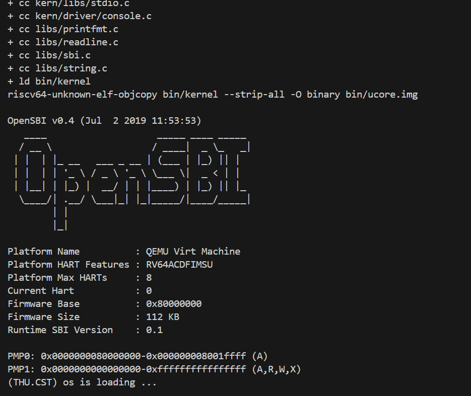
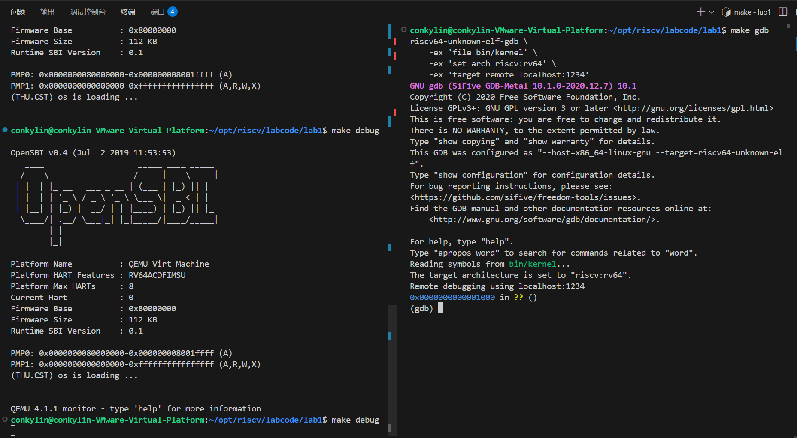
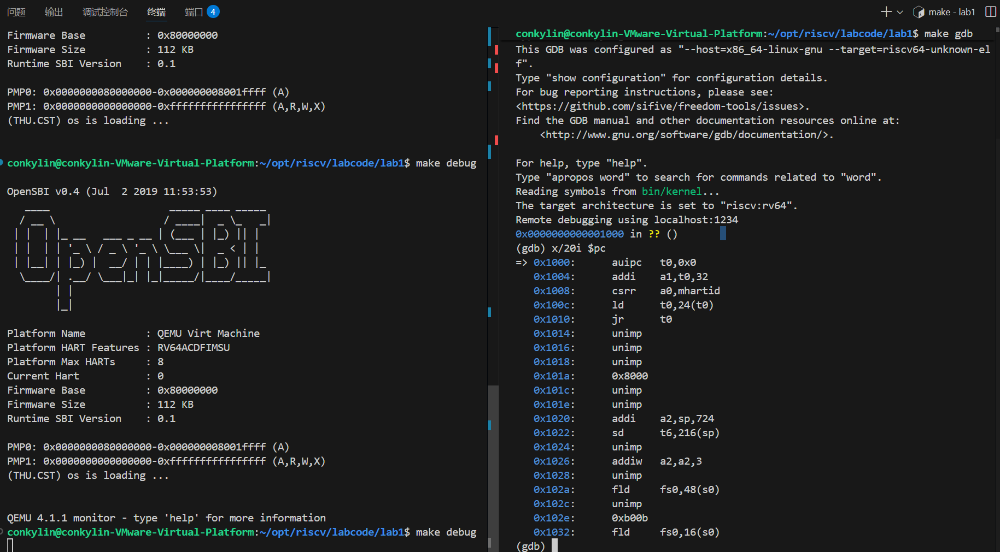
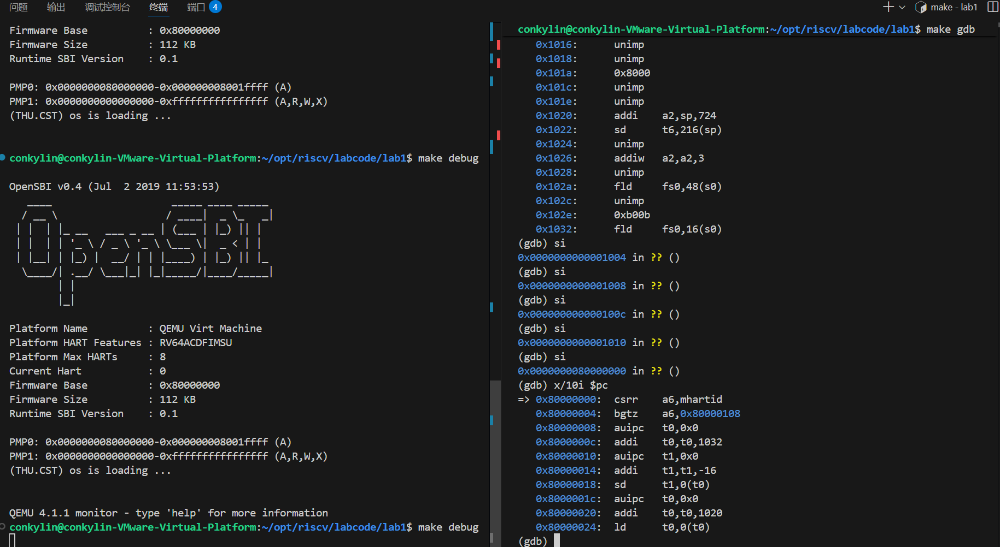
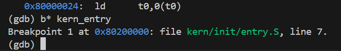
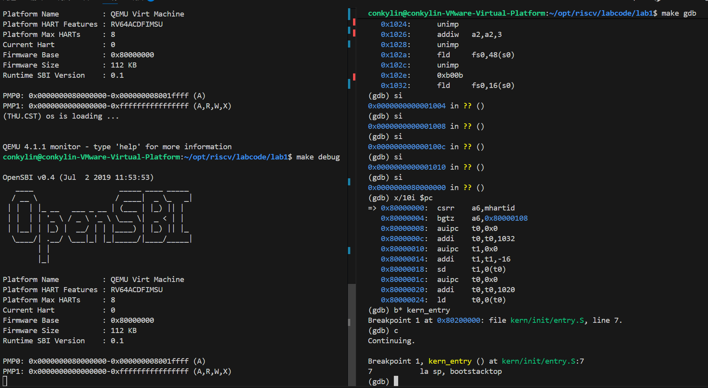

# Lab1实验报告

## 小组成员
| 姓名 | 学号 |
| :--- | :--- |
| 郑权 | 2312482 |
| 王玉涛 | 2312364 |

## 一、实验步骤
1. 完成环境的创建，并成功运行OpenSBI
   
   我们输入make qemu后效果如下所示

   

2. 进行GDB调试
   
   首先，我们分别在两个终端输入了make debug,make gdb实现效果如下：
   
   然后我们输入x/20i $pc想要查看当前指令后的20条指令，并发现在第五条指令出就已经发生了跳转图片如下：
   
   我们执行了五步验证是否跳转到了0x80000000，结果证明推理正确：
   
   按照实验要求在开始的函数处打断点：
   
   然后我们通过continue指令执行到了OpenSBI初始化完成时即0x80200000处：
   
   调试完成
## 二、练习题
1.  **练习一：理解内核启动中的程序入口操作**
   
    1. 说明指令 la sp, bootstacktop 完成了什么操作，目的是什么？

        将bootstacktop的地址赋值给sp，目的：设置内核栈指针，为C语言函数调用分配栈空间，准备C语言运行环境
    2.  tail kern_init 完成了什么操作，目的是什么？
    
        尾调用，让函数执行跳转到kern_init,目的：运行kern_init()函数，kern_init()调用cprintf()输出一行信息，表示内核启动成功。

2.  **练习二：使用GDB验证启动流程**
   
    1. RISC-V 硬件加电后最初执行的几条指令位于什么地址？
    
        在我们调试的过程中最初的几条指令分别在，0x1000到0x1010之间
    2. 它们主要完成了哪些功能？

         分别分析五条指令：

         auipc t0,0x0   ：auipc指令将20位的立即数左移12位后，与当前程序计数器（PC）的值相加，结果写入目标寄存器。此处立即数为0，因此t0 = PC + (0 << 12)。

         addi a1, t0, 32    ：t0的值为0x1000，立即数32（十六进制为0x20）经过符号扩展后仍是32。因此a1 = 0x1000 + 32 = 0x1020。

         csrr a0, mhartid   ：mhartid是一个CSR，存储当前硬件线程的ID，将mhartid的值读取到寄存器a0中，a0=mhartid=0。

         ld t0, 24(t0)  ：t0 = [t0 + 24] = 0x80000000。

         jr t0  ：跳转指令，当前指令跳转到t0。

