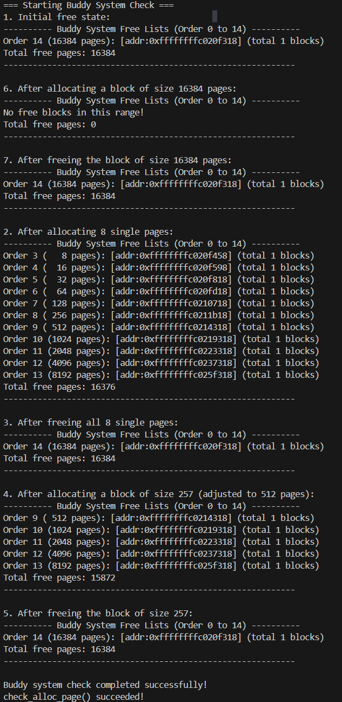
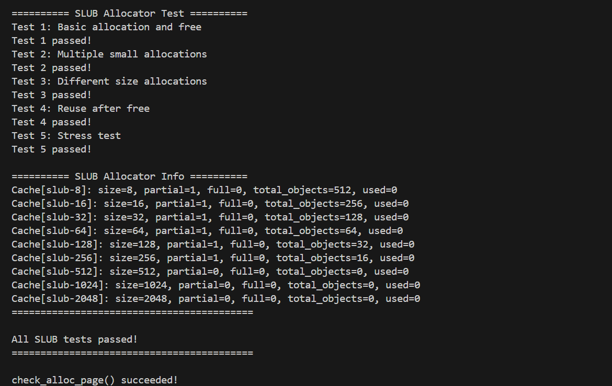

# Lab2实验报告

## 小组成员
| 姓名 | 学号 |
| :--- | :--- |
| 郑权 | 2312482 |
| 王玉涛 | 2312364 |
| 岳科言 | 2312163 |

## 一、实验目的
1. 理解页表的建立和使用方法
2. 理解物理内存的管理方法
3. 理解页面分配算法

---

## 二、实验内容
### 练习1：理解First-Fit连续物理内存分配算法

first-fit 连续物理内存分配算法作为物理内存分配一个很基础的方法，需要同学们理解它的实现过程。请大家仔细阅读实验手册的教程并结合kern/mm/default_pmm.c中的相关代码，认真分析default_init，default_init_memmap，default_alloc_pages， default_free_pages等相关函数，并描述程序在进行物理内存分配的过程以及各个函数的作用。 请在实验报告中简要说明你的设计实现过程。请回答如下问题：

- 你的first fit算法是否有进一步的改进空间？

### 练习2：实现Best-Fit连续物理内存分配算法
在完成练习一后，参考kern/mm/default_pmm.c对First Fit算法的实现，编程实现Best Fit页面分配算法，算法的时空复杂度不做要求，能通过测试即可。 请在实验报告中简要说明你的设计实现过程，阐述代码是如何对物理内存进行分配和释放，并回答如下问题：

- 你的 Best-Fit 算法是否有进一步的改进空间？

### 扩展练习Challenge：buddy system（伙伴系统）分配算法
Buddy System算法把系统中的可用存储空间划分为存储块(Block)来进行管理, 每个存储块的大小必须是2的n次幂(Pow(2, n)), 即1, 2, 4, 8, 16, 32, 64, 128...

参考伙伴分配器的一个极简实现， 在ucore中实现buddy system分配算法，要求有比较充分的测试用例说明实现的正确性，需要有设计文档。

### 扩展练习Challenge：任意大小的内存单元slub分配算法
slub算法，实现两层架构的高效内存单元分配，第一层是基于页大小的内存分配，第二层是在第一层基础上实现基于任意大小的内存分配。可简化实现，能够体现其主体思想即可。

参考linux的slub分配算法/，在ucore中实现slub分配算法。要求有比较充分的测试用例说明实现的正确性，需要有设计文档。

### 扩展练习Challenge：硬件的可用物理内存范围的获取方法

如果 OS 无法提前知道当前硬件的可用物理内存范围，请问你有何办法让 OS 获取可用物理内存范围？

---

## 三、实验过程及截图

首先我们需要先测试代码的正确性，我们就执行了make qemu指令得到理想的结果：


在修改完best-fit算法后，我们将pmm.c文件修改后，完成了测试make grade得到了实验结果：


以及我们challenge的结果截图：

buddy:


slub:


---

## 四、实验步骤与结果
### 练习1：First-Fit算法分析
First-Fit算法从空闲内存块列表的头部开始扫描，选择第一个满足大小要求的空闲块进行分配。

#### 关键函数作用
1. default_init（）：初始化空闲链表和空闲页计数器,这是一个将空闲链表的表头形成我们所需要的双向循环链表的函数，nr_free = 0表示这还是一个空的链表
2. default_init_memmap()：将物理页按地址顺序插入空闲链表，维护链表有序性，此函数中通过le2page()函数实现了通过空闲链表中的节点的地址获取空闲页结构体的起始地址，这样就可以判断地址的顺序来插入地址了。
3. default_alloc_pages()：扫描空闲链表，找到第一个大小≥请求页数的块；若该块有剩余空间，将其分割后重新插入链表。
4. default_free_pages()：释放内存页，合并相邻空闲块以避免碎片。

#### 物理内存分配过程
1. 系统启动时初始化空闲内存链表。
2. 分配请求时，从头扫描链表，选择第一个足够大的块。
3. 分配后更新链表：若块有剩余，分割剩余部分并保留；若完全分配，从链表中删除该块。这次分配的实现其实是先把块从链表中删除，然后如果有剩余再次放回链表中。这时就是在把所需块在空闲列表取出后，将多余出来的后半部分再加入空闲列表。
4. 释放内存时，检查相邻块是否空闲，合并后重新插入链表，先向前合并，再向后合并，顺序无所谓，但第一次合并后一定有一个base=p即合并后的地址这样首地址和大小才会变。

#### 问题回答：你的first fit算法是否有进一步的改进空间？
First-Fit容易产生外部碎片。可改进的方向包括：

使用更高效的链表结构加速搜索，降低时间复杂度。

实现碎片整理机制，定期合并空闲块。

### 练习2：Best-Fit算法实现
#### 设计实现过程
Best-Fit算法选择满足需求的最小空闲块，以减少碎片。本次实验主要是修改default_alloc_pages()函数：
1. 分配逻辑：
   
        扫描整个空闲链表，记录所有满足需求的块。
        
        这里我们的实现通过遍历空闲链表来完成，采用了通过minsize来记录满足条件的最小块的方式，其中的一种特殊情况，就是当空闲块大小正好等于所需要分配的空间大小的时候，直接采用，不再遍历以节省时间。

        分配后处理剩余空间。即当所需空间小于空闲块时就将剩余的空间作为空闲块放入空闲链表。与first-fit逻辑相同。
2. 释放逻辑：这里也与First-Fit相同，需合并相邻空闲块。

#### 代码关键修改：

        while ((le = list_next(le)) != &free_list) {
        struct Page *p = le2page(le, page_link);
        if (p->property == n) {
            min_size=p->property;
            page = p;
            break;
        }else if(p->property > n && p->property < min_size)
        {
            min_size=p->property;
            page = p;
        }
        }
        这里就是分配时的查找逻辑。

        其余部分的代码添加只需要与first-fit的逻辑相同即可。


#### 问题回答：你的 Best-Fit 算法是否有进一步的改进空间？
改进空间：  
  Best-Fit虽减少外部碎片，但搜索全链表导致时间复杂度高，而且在不断的使用小空间后会造成一些极小的碎片产生造成资源浪费。改进方向：

  使用大小分类的空闲链表，将空闲块按大小分组，加速搜索。因为在按地址顺序排序的搜索过程中，在我们设定的正好等于所需空间大小的块概率很低，因此几乎每次都将要遍历整个链表时间复杂度会很高，而用了大小顺序就可以解决这一个问题。

  此外还有一种想法就是在按地址顺序进行搜索的过程中，可以设定一个误差范围，即当我们所需空间的大小小于搜索到的内存块时只要在设置的误差范围内就直接使用，也就是中和一下first和best的逻辑。

### challenge1，buddy算法实现：
#### 关键代码分析：

1. buddy_init()：
   
        buddy_init函数负责初始化伙伴系统的全局数据结构，为内存分配做准备
        。该函数不接收参数，主要执行以下操作：

        ​初始化空闲链表数组​：通过循环遍历从0到MAX_BUDDY_ORDER的每个阶（order），使用list_init初始化buddy_array中每个阶对应的空闲链表。这些链表用于管理不同大小的空闲内存块。

        ​重置系统状态变量​：将max_order（当前最大可用阶数）和nr_free（总空闲页面数）设置为0，确保系统初始状态为空闲。

        ​作用​：此函数在系统启动时调用一次，确保所有数据结构处于就绪状态。例如，若MAX_BUDDY_ORDER为10，则初始化11个链表（阶0到10），分别管理1页、2页、4页直至1024页的空闲块。

2. buddy_init_memmap()
   
        buddy_init_memmap函数将一段物理内存初始化为伙伴系统可管理的结构，其参数包括起始页面指针base和页面数量n。实现逻辑如下：

        ​计算可用内存大小​：使用辅助函数Find_The_Small_2(n)找到不大于n的最大2的幂次方页面数（如n=1000时返回512），并通过Get_Order_Of_2计算对应的阶（如512页对应阶9）。

        ​初始化页面属性​：遍历每个页面，清除保留标志以外的所有状态，设置引用计数为0，并标记为未分配。例如，代码中通过p->flags = 0和set_page_ref(p, 0)重置页面元数据。

        ​设置基页属性并加入空闲链表​：将整个内存块作为单个空闲块处理，设置基页的property字段为阶数，并将其插入对应阶的空闲链表（如阶9的链表）。同时更新max_order和nr_free。

        ​关键点​：该函数确保内存块按2的幂次方对齐，为后续分裂合并奠定基础。例如，若初始内存为1000页，仅512页被初始化，剩余488页暂不管理。

3. buddy_alloc_pages()
   
        buddy_alloc_pages函数用于分配连续物理页面，其核心是通过分裂操作匹配请求大小。算法步骤如下：

        ​请求大小对齐​：使用Find_The_Big_2(n)将请求页面数向上对齐到最近的2的幂次方（如n=257时对齐到512），并计算所需阶req_order。

        ​查找合适空闲块​：从req_order开始向上扫描空闲链表（如阶9无空闲则查阶10），直到找到非空链表。若所有高阶均无空闲，返回失败。

        ​块分裂处理​：若当前块阶高于请求阶（如找到阶10的块但需阶9），递归调用buddy_split进行分裂。分裂时，将大块均分为两个伙伴块，并添加到低一阶链表。例如，阶10的块（1024页）分裂为两个阶9的块（各512页）。

        ​分配与更新​：从目标阶链表取出块，清除其"属性"标志并标记为"已保留"，更新空闲页面计数nr_free。

        ​性能特征​：分配时间复杂度为O(log N)，其中N是最大阶数，确保高效性。

4. buddy_free_pages()
   
        buddy_free_pages函数释放已分配页面，并尝试合并伙伴块以减少碎片。其实现包括：

        ​页面状态恢复​：遍历释放的页面，清除"已保留"标志，设置"属性"标志，并将基页重新加入对应阶的空闲链表。

        ​伙伴合并逻辑​：循环检查当前块的伙伴块是否空闲且大小相同。通过get_buddy计算伙伴地址（利用地址异或操作：buddy_address = current_address ^ (1 << order)），并验证其物理地址是否连续。若伙伴空闲，则合并两者，生成更高阶的块，并递归检查进一步合并可能。

        ​合并条件​：伙伴块需满足同阶、空闲、地址相邻三个条件。合并后，新块地址取两者中较低者，并更新阶数和链表位置。

        ​作用​：此过程有效减少外部碎片，确保内存利用率。例如，两个相邻的阶3块（各8页）可合并为一个阶4块（16页）。

#### 测试样例解释：

在我们的测试样例中，我们首先进行的是一整个内存的分配和释放，其次进行的是对于四个大小为2的内存的分配和释放，然后进行了大小为257的块的分配和释放，由输出结果看：

    After allocating a block of size 16384 pages:

    ---------- Buddy System Free Lists (Order 0 to 14) ----------

    No free blocks in this range!

    Total free pages: 0

    After freeing the block of size 16384 pages:

    ---------- Buddy System Free Lists (Order 0 to 14) ----------

    Order 14 (16384 pages): [addr:0xffffffffc020f318] (total 1 blocks)

    Total free pages: 16384

我们查看空闲块确实是分配并释放成功了，在我们的第二个测试中：

    Order 3 (   8 pages): [addr:0xffffffffc020f458] (total 1 blocks)
    Order 4 (  16 pages): [addr:0xffffffffc020f598] (total 1 blocks)
    Order 5 (  32 pages): [addr:0xffffffffc020f818] (total 1 blocks)
    Order 6 (  64 pages): [addr:0xffffffffc020fd18] (total 1 blocks)
    Order 7 ( 128 pages): [addr:0xffffffffc0210718] (total 1 blocks)
    Order 8 ( 256 pages): [addr:0xffffffffc0211b18] (total 1 blocks)
    Order 9 ( 512 pages): [addr:0xffffffffc0214318] (total 1 blocks)
    Order 10 (1024 pages): [addr:0xffffffffc0219318] (total 1 blocks)
    Order 11 (2048 pages): [addr:0xffffffffc0223318] (total 1 blocks)
    Order 12 (4096 pages): [addr:0xffffffffc0237318] (total 1 blocks)
    Order 13 (8192 pages): [addr:0xffffffffc025f318] (total 1 blocks)
    Total free pages: 16376

也是证明了我们拆分块的逻辑是正确的。
以及最后合并成功说明我们释放块的逻辑也是正确的。

第三个测试样例中，我们测试分配257的大小的块，此时输出结果显示我们申请了512的大小，证明我们将每一个块都设置为2的阶的逻辑也是正确的，且寻找合适的块的逻辑也正确：

    After allocating a block of size 257 (adjusted to 512 pages):
    ---------- Buddy System Free Lists (Order 0 to 14) ----------
    Order 9 ( 512 pages): [addr:0xffffffffc0214318] (total 1 blocks)
    Order 10 (1024 pages): [addr:0xffffffffc0219318] (total 1 blocks)
    Order 11 (2048 pages): [addr:0xffffffffc0223318] (total 1 blocks)
    Order 12 (4096 pages): [addr:0xffffffffc0237318] (total 1 blocks)
    Order 13 (8192 pages): [addr:0xffffffffc025f318] (total 1 blocks)
    Total free pages: 15872

buddy算法实现完成。

### challenge2，slub算法实现：

#### 概述

为常见的小对象预先准备固定大小的对象池，每次快速分配／释放；  
当对象池耗尽时申请新页并切分；  
当页面空闲回到一个阈值时释放回底层。

#### 一、函数

##### (1) 综述

- **`slub_init()`**  
  初始化所有 `slub_cache`，设置 `size`、`align`、`objects_per_page`。

- **`slub_get_cache(size)`**  
  将请求大小映射到一个合适的 cache。

- **`slub_alloc_page_internal(cache)`**  
  执行 “新页分配 → 创建 `slub_page` → 构建对象链表” 的流程。

- **`slub_alloc_object(cache)`**  
  从 cache 中取对象。

- **`slub_free_object(cache, ptr)` / `slub_free_page(cache, sp)`**  
  执行释放对象及可能释放页。

- **`slub_init_memmap()` / `slub_alloc_pages()` / `slub_free_pages()`**  
  实现底层页管理。

---

##### (2) 具体实现

###### 初始化阶段

**`slub_init`**

- `free_list` 和 `nr_free` 用于底层页管理（PMM 空闲页链表）。  
- 对每个 `slub_cache`（对应不同对象大小，如 8B、16B … 2048B）进行设置：  
  - `cache->size = slub_sizes[i]`：设定该 cache 管理的对象大小。  
  - `cache->objects_per_page = PGSIZE / cache->size`：每页可容纳的对象数。  
- 初始化链表：
  - `partial`（部分使用中的页面）
  - `full`（已满的页面）
- 初始化统计变量：
  - `nr_partial`, `nr_full`, `total_objects`, `used_objects` 均归零。
- 初始化完成后：
  - 每个对象大小对应一个 cache；
  - 当前无已分配页，`partial` / `full` 链表为空。

---

###### PMM 初始化

- **`slub_init_memmap()`**  
  初始化物理页描述符。

- **`slub_alloc_pages()`**  
  查找 `p->property >= n` 的页块，如大于则分割剩余部分。

- **`slub_free_pages()`**  
  释放 `n` 页并插回 `free_list`，可合并相邻空闲块。

---

###### 对象分配流程

- **`slub_alloc(size)`**  
  - 若 `size > SLUB_MAX_SIZE` → 直接页分配（跳过小对象池）。  
  - 否则 → 调用 `slub_get_cache(size)` 获取对应 cache。

- **`slub_get_cache(size)`**  
  查找第一个 `slub_sizes[i] >= size` 的 cache。  
  例如：`size=20B` → 使用 `slub_sizes={8,16,32,…}` 中的 `32B` cache。

- **`slub_alloc_object(cache)`**
  1. 若 `cache->partial` 非空 → 取第一个 `slub_page`。  
  2. 若为空 → 调用 `slub_alloc_page_internal(cache)` 申请新页。  
  3. 从 `sp->freelist` 中取出对象，更新：
     - `sp->freelist`
     - `sp->inuse++`
     - `cache->used_objects++`
  4. 若 `sp->inuse == sp->objects` → 移入 `cache->full` 链表。  
  5. 返回对象地址（并清零内存）。

- **`slub_alloc_page_internal(cache)`**
  1. 从底层页分配器申请 1 页（`slub_alloc_pages(1)`）。
  2. 得到 `struct Page *page`。
  3. 虚拟地址：`page_addr = page2kva(page)`。
  4. 页首放置元数据结构：
     ```c
     struct slub_page *sp = (struct slub_page *)page_addr;
     ```
  5. 初始化：
     ```c
     sp->cache = cache;
     sp->page = page;
     sp->inuse = 0;
     sp->objects = cache->objects_per_page;
     ```
  6. 构建对象链表：
     - 计算对象起始位置：`obj_start = page_addr + sizeof(slub_page)`；
     - 按 `cache->align` 对齐；
     - 每隔 `cache->size` 字节设一个对象；
     - 最后一个对象 `next = NULL`。
  7. 插入 `cache->partial` 链表：
     - `cache->nr_partial++`
     - `cache->total_objects += objects_per_page`

---

###### 对象释放流程

- **`slub_free(ptr)`**
  1. `addr_to_slub_page(ptr)` 找到对应 `slub_page sp`；
  2. 若非 SLUB 管理（`sp->cache == NULL` 或 `sp->cache->size > SLUB_MAX_SIZE`），走页面释放路径；
  3. 否则 → 调用 `slub_free_object()`。

- **`slub_free_object(cache, ptr)`**
  1. `obj = (struct slub_object *)ptr`；
  2. 插入空闲链表：
     ```c
     obj->next = sp->freelist;
     sp->freelist = obj;
     ```
  3. 更新计数：
     - `sp->inuse--`
     - `cache->used_objects--`

- **`slub_free_page(cache, sp)`**
  - 若页从 “满” 变 “非满” → 从 `full` 移到 `partial`；
  - 若页完全空闲（`sp->inuse == 0`）且 `cache->nr_partial > 1`：
    - 调用 `slub_free_page(cache, sp)`：
      - 删除页链表节点；
      - 更新统计；
      - 调用 `slub_free_pages(sp->page, 1)` 将页释放回 PMM。
  - 此策略减少频繁申请/释放带来的性能损耗。

---

#### 二、整体流程

##### 1. 分配流程：`slub_alloc(size)`
1. 若 `size > SLUB_MAX_SIZE` → 直接页分配。
2. 否则：
   - 获取 cache；
   - 若 cache 有可用页 → 取对象；
   - 否则申请新页；
   - 更新计数；
   - 若页满 → 移入 `full`。

##### 2. 释放流程：`slub_free(ptr)`
1. 根据地址找到页；
2. 若为 SLUB 管理：
   - 将对象插入 freelist；
   - 若页由满变部分 → 调整链表；
   - 若页空闲且部分页多于 1 → 释放页回 PMM。
3. 若非 SLUB 管理 → 页级释放。

##### 3. 底层页分配器
- **`slub_alloc_pages(n)`**：查找可用空闲块并分割。  
- **`slub_free_pages(base, n)`**：释放并合并相邻空闲块，维护 `free_list`。

---


#### 三、测试

##### 测试一：基本分配释放

1. 调用 `void *p1 = slub_alloc(10);`
   - size = 10 字节。
   - `slub_init` 如果尚未初始化则初始化。
   - 选择适当 cache（假设 cache sizes={8,16,32,…}，第一个 ≥10 是 16）, 即选择 16 字节缓存。
   - 调用 `slub_alloc_object(cache_16)` 分配一个对象。

2. 同理调用  
   `p2 = slub_alloc(20); → size=20 → cache size=32。`

3. 同理调用  
   `p3 = slub_alloc(100); → size=100 → 缓存 size 可能 128 或更大（如 128）。`

4. 三个指针断言非 NULL：  
   `assert(p1!=NULL && p2!=NULL && p3!=NULL);`

5. 断言三者地址互不相等：  
   `assert(p1!=p2 && p2!=p3 && p1!=p3);`  
   以确保分配器没有返回同一地址。

6. 释放这三个对象：  
   `slub_free(p1); slub_free(p2); slub_free(p3);`
   - 对于每个释放：找到其对应 slub_page，更新 freelist、inuse 计数、可能返还页。

##### 测试二：大量小对象分配

1. 声明 `void *ptrs[100];`。

2. 循环  
`for (int i=0; i<100; i++) { ptrs[i] = slub_alloc(8); assert(ptrs[i]!=NULL); *(int*)ptrs[i] = i; }`  
每次分配 size=8 字节（即最小缓存）100 个对象。  
为每个对象写入数据 i。  

4. 验证循环：  
`for (i=0; i<100; i++) assert(*(int*)ptrs[i] == i);`  
确认数据写入/读出正确。  

5. 释放所有对象：  
`for (i=0; i<100; i++) slub_free(ptrs[i]);`  

---

##### 测试三：不同大小的分配

1. 分配多个不同大小：  
`void *p8   = slub_alloc(8);`  
`void *p16  = slub_alloc(16);`  
`void *p32  = slub_alloc(32);`  
`void *p64  = slub_alloc(64);`  
`void *p128 = slub_alloc(128);`  
`void *p256 = slub_alloc(256);`  

确认每个非 NULL：`assert(p8 && p16 && p32 && p64 && p128 && p256);`  

2. 写入测试数据：  
`memset(p8,   0x11,   8);`  
`memset(p16,  0x22,  16);`  
`memset(p32,  0x33,  32);`  
`memset(p64,  0x44,  64);`  
`memset(p128, 0x55, 128);`  
`memset(p256, 0x66, 256);`  

3. 验证写入：  
`assert(*(char*)p8   == 0x11);`  
`assert(*(char*)p16  == 0x22);`  
etc…  

4. 释放所有对象:  
`slub_free(p8); slub_free(p16); slub_free(p32); slub_free(p64); slub_free(p128); slub_free(p256);`  

---

##### 测试四：分配后重用

1. 分配一个对象： `void *q1 = slub_alloc(32);`  
size=32 → 相应 cache。  

2. 保存其地址： `void *q1_addr = q1;`  
3. 释放该对象： `slub_free(q1);`  
4. 再次分配同样大小： `void *q2 = slub_alloc(32);`  
5. 断言新分配对象地址与上次相同： `assert(q1_addr == q2);`  
意味着释放后的对象被立即重用。  
6. 释放它： `slub_free(q2);`  

---

##### 测试 5：压力测试  
(由于为简化实现，这里的 STRESS_COUNT 未设太大)

1. 定义 `#define STRESS_COUNT 1` 和数组 `void *stress_ptrs[STRESS_COUNT];`  

2. 外循环 `for (round = 0; round < 3; round++) { … }` 重复三轮：  

分配阶段：  
`for (i=0; i<STRESS_COUNT; i++) { size_t size = (i%8 +1)*8; stress_ptrs[i] = slub_alloc(size); assert(stress_ptrs[i]!=NULL); *(int*)stress_ptrs[i] = i; }`  
→ 大量（1000）对象分配，大小按 8、16、24…64 字节循环。  

验证阶段：  
`for (i=0; i<STRESS_COUNT; i++) { assert(*(int*)stress_ptrs[i] == i); }`  
→ 确保所有写入的数据正确。  

释放一半：  
`for (i=0; i<STRESS_COUNT; i+=2) { slub_free(stress_ptrs[i]); stress_ptrs[i] = NULL; }`  
→ 释放偶数索引对象，奇数仍保留。  

重新分配释放掉的那一半：  
`for (i=0; i<STRESS_COUNT; i+=2) { size_t size = (i%8 +1)*8; stress_ptrs[i] = slub_alloc(size); assert(stress_ptrs[i]!=NULL); *(int*)stress_ptrs[i] = i*2; }`  
→ 分配同样大小对象，再写入值 i*2。  

全部释放阶段：  
`for (i=0; i<STRESS_COUNT; i++) { if (stress_ptrs[i]) slub_free(stress_ptrs[i]); }`  
→ 释放所有剩余对象。  


### challenge3,如果 OS 无法提前知道当前硬件的可用物理内存范围，请问你有何办法让 OS 获取可用物理内存范围？

1. BIOS中断调用方法​

        在传统x86架构中，操作系统可利用BIOS的INT 15h中断服务获取内存信息。其中子功能号需存入特定寄存器（如EAX），BIOS会返回内存描述符数组。关键子功能包括：

        ​0xE820​：最详细的方法，通过迭代调用返回多个"地址范围描述符"（ARDS）。每个描述符包含基地址、长度和类型（如Type=1表示可用内存，Type=2表示保留区域）。操作系统通过多次调用此中断直至返回结束标志，从而构建完整内存映射。

        ​0xE801和0x88​：适用于较老系统，但存在局限性（如0x88仅能检测最多64MB内存）。这些方法通过寄存器直接返回内存大小值，但无法提供细粒度的内存区域属性。

2. UEFI接口方法​

        现代UEFI系统通过GetMemoryMap()启动服务提供内存信息。该服务返回一个内存描述符数组，描述符中包含物理地址范围、类型（如可用内存、ACPI保留内存等）及属性。操作系统加载器在调用ExitBootServices()前获取此映射，并传递给内核。此方法支持大于4GB的内存且能准确区分NUMA节点等复杂拓扑。

3. 操作系统内核的初始化流程​

        Linux等系统在启动阶段通过架构特定代码（如x86的setup_arch()函数）调用固件接口。例如：

        在x86平台，e820__memory_setup()函数解析BIOS提供的内存映射，并过滤出可用区域存入内核的e820_table。

        内核进一步初始化伙伴系统管理可用内存，并通过/proc/meminfo等接口暴露给用户空间（如MemTotal字段即为探测到的总物理内存）。

---

## 五、知识点分析
### 实验中重要知识点与OS原理对应
| 实验知识点 | OS原理知识点 | 含义与关系 |
|-----------|-------------|-----------|
| 连续内存分配 | 内存管理基础 | 实验中的First-Fit/Best-Fit是原理中连续分配算法的具体实现，差异在于原理侧重理论模型，实验关注代码级细节。 |
| 空闲链表管理 | 动态分区分配 | 实验通过链表维护空闲块，原理中描述通用结构；实验需处理指针操作。 |
| 碎片问题 | 外部碎片 | 实验直观展示碎片产生，原理分析碎片的成因和影响。 |

### 原理重要但实验未涉及的知识点
非连续内存分配（如页式、段式管理）：实验仅涉及连续分配，未覆盖虚拟内存和地址转换。