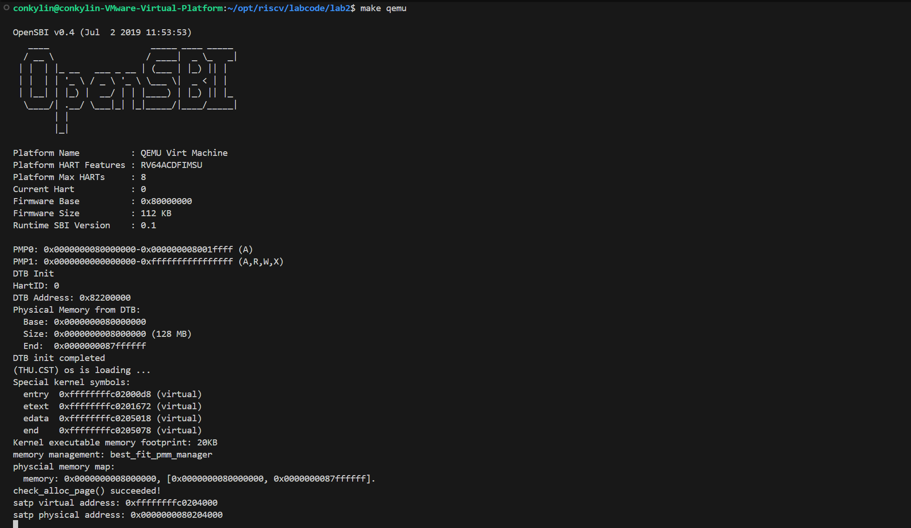
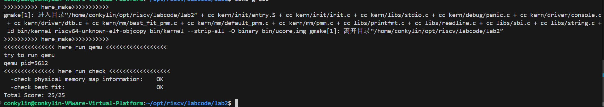

# Lab2实验报告

## 小组成员
| 姓名 | 学号 |
| :--- | :--- |
| 郑权 | 2312482 |
| 王玉涛 | 2312364 |
| 岳科言 | 2312163 |

## 一、实验目的
1. 理解页表的建立和使用方法
2. 理解物理内存的管理方法
3. 理解页面分配算法

---

## 二、实验内容
### 练习1：理解First-Fit连续物理内存分配算法

first-fit 连续物理内存分配算法作为物理内存分配一个很基础的方法，需要同学们理解它的实现过程。请大家仔细阅读实验手册的教程并结合kern/mm/default_pmm.c中的相关代码，认真分析default_init，default_init_memmap，default_alloc_pages， default_free_pages等相关函数，并描述程序在进行物理内存分配的过程以及各个函数的作用。 请在实验报告中简要说明你的设计实现过程。请回答如下问题：

- 你的first fit算法是否有进一步的改进空间？

### 练习2：实现Best-Fit连续物理内存分配算法
在完成练习一后，参考kern/mm/default_pmm.c对First Fit算法的实现，编程实现Best Fit页面分配算法，算法的时空复杂度不做要求，能通过测试即可。 请在实验报告中简要说明你的设计实现过程，阐述代码是如何对物理内存进行分配和释放，并回答如下问题：

- 你的 Best-Fit 算法是否有进一步的改进空间？

---
## 三、实验过程及截图

首先我们需要先测试代码的正确性，我们就执行了make qemu指令得到理想的结果：
    

在修改完best-fit算法后，我们将pmm.c文件修改后，完成了测试make grade得到了实验结果：

---

## 四、实验步骤与结果
### 练习1：First-Fit算法分析
First-Fit算法从空闲内存块列表的头部开始扫描，选择第一个满足大小要求的空闲块进行分配。

#### 关键函数作用
1. default_init（）：初始化空闲链表和空闲页计数器。
2. default_init_memmap()：将物理页按地址顺序插入空闲链表，维护链表有序性。
3. default_alloc_pages()：扫描空闲链表，找到第一个大小≥请求页数的块；若该块有剩余空间，将其分割后重新插入链表。
4. default_free_pages()：释放内存页，合并相邻空闲块以避免碎片。

#### 物理内存分配过程
1. 系统启动时初始化空闲内存链表。
2. 分配请求时，从头扫描链表，选择第一个足够大的块。
3. 分配后更新链表：若块有剩余，分割剩余部分并保留；若完全分配，从链表中删除该块。这次分配的实现其实是先把块从链表中删除，然后如果有剩余再次放回链表中。
4. 释放内存时，检查相邻块是否空闲，合并后重新插入链表。

#### 问题回答：你的first fit算法是否有进一步的改进空间？
First-Fit容易产生外部碎片。可改进的方向包括：

使用更高效的链表结构加速搜索，降低时间复杂度。

实现碎片整理机制，定期合并空闲块。

### 练习2：Best-Fit算法实现
#### 设计实现过程
Best-Fit算法选择满足需求的最小空闲块，以减少碎片。本次实验主要是修改default_alloc_pages()函数：
1. 分配逻辑：
   
        扫描整个空闲链表，记录所有满足需求的块。
        
        这里我们的实现通过遍历空闲链表来完成，采用了通过minsize来记录满足条件的最小块的方式，其中的一种特殊情况，就是当空闲块大小正好等于所需要分配的空间大小的时候，直接采用，不再遍历以节省时间。

        分配后处理剩余空间。即当所需空间小于空闲块时就将剩余的空间作为空闲块放入空闲链表。与first-fit逻辑相同。
2. 释放逻辑：这里也与First-Fit相同，需合并相邻空闲块。

#### 代码关键修改：

        while ((le = list_next(le)) != &free_list) {
        struct Page *p = le2page(le, page_link);
        if (p->property == n) {
            min_size=p->property;
            page = p;
            break;
        }else if(p->property > n && p->property < min_size)
        {
            min_size=p->property;
            page = p;
        }
        }
        这里就是分配时的查找逻辑。

        其余部分的代码添加只需要与first-fit的逻辑相同即可。

#### 问题回答：你的 Best-Fit 算法是否有进一步的改进空间？
改进空间：  
  Best-Fit虽减少外部碎片，但搜索全链表导致时间复杂度高，而且在不断的使用小空间后会造成一些极小的碎片产生造成资源浪费。改进方向：

  使用大小分类的空闲链表，将空闲块按大小分组，加速搜索。因为在按地址顺序排序的搜索过程中，在我们设定的正好等于所需空间大小的块概率很低，因此几乎每次都将要遍历整个链表时间复杂度会很高，而用了大小顺序就可以解决这一个问题。

  此外还有一种想法就是在按地址顺序进行搜索的过程中，可以设定一个误差范围，即当我们所需空间的大小小于搜索到的内存块时只要在设置的误差范围内就直接使用，也就是中和一下first和best的逻辑。

---

## 五、知识点分析
### 实验中重要知识点与OS原理对应
| 实验知识点 | OS原理知识点 | 含义与关系 |
|-----------|-------------|-----------|
| 连续内存分配 | 内存管理基础 | 实验中的First-Fit/Best-Fit是原理中连续分配算法的具体实现，差异在于原理侧重理论模型，实验关注代码级细节。 |
| 空闲链表管理 | 动态分区分配 | 实验通过链表维护空闲块，原理中描述通用结构；实验需处理指针操作。 |
| 碎片问题 | 外部碎片 | 实验直观展示碎片产生，原理分析碎片的成因和影响。 |

### 原理重要但实验未涉及的知识点
非连续内存分配（如页式、段式管理）：实验仅涉及连续分配，未覆盖虚拟内存和地址转换。