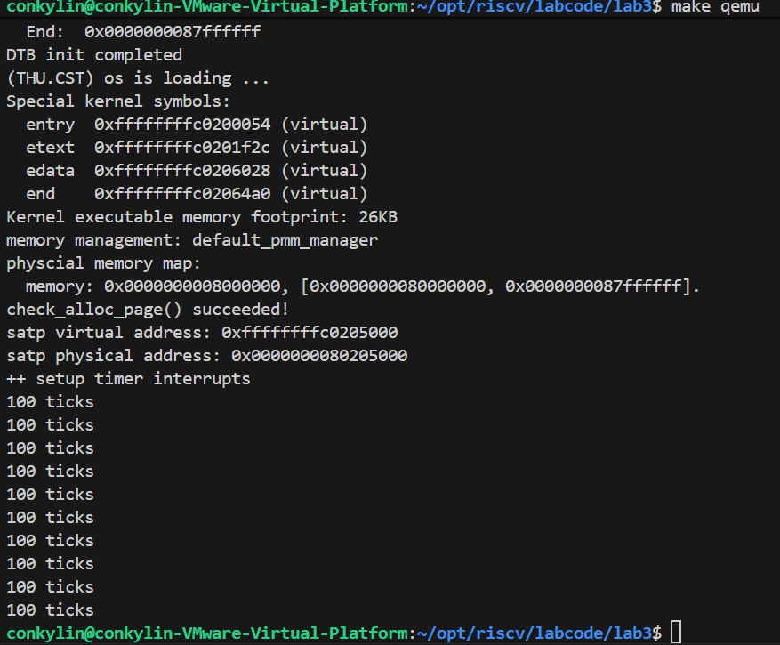
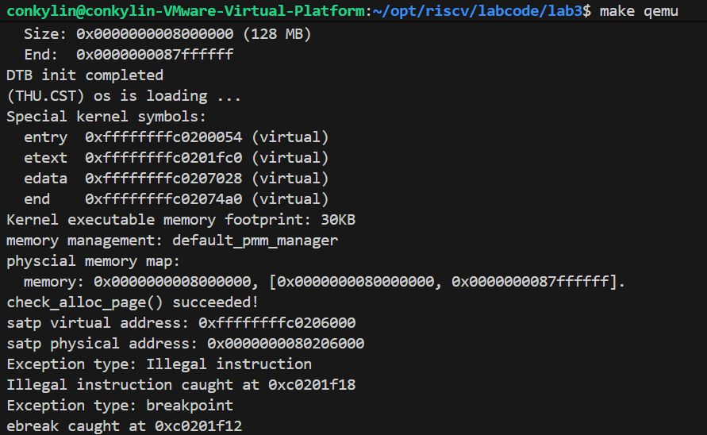

# Lab3实验报告

## 小组成员
| 姓名 | 学号 |
| :--- | :--- |
| 郑权 | 2312482 |
| 王玉涛 | 2312364 |
| 岳科言 | 2312163 |

## 一、实验目的
1. 理解操作系统中的中断处理机制，包括时钟中断的产生和处理流程
2. 掌握RISC-V架构下中断处理的基本原理，包括特权级切换、上下文保存与恢复
3. 通过编程实现时钟中断处理，加深对中断处理流程和上下文切换的理解
4. 分析中断处理与操作系统原理的关联，包括进程调度、系统安全等核心概念

## 二、实验原理

### 2.1 中断与异常的基本概念
在RISC-V架构中，**Trap**是一个总称，涵盖中断（Interrupt）和异常（Exception）两类事件。中断是异步事件，由外部设备触发（如时钟中断、I/O中断）；异常是同步事件，由当前指令触发（如非法指令、缺页异常）。中断处理是操作系统实现多任务和资源管理的核心机制，通过打断当前执行流，处理紧急事件，再恢复原流程。

### 2.2 RISC-V特权级与中断路由

RISC-V包含三个特权级：

  U模式（User Mode）：用户程序运行的低特权级

  S模式（Supervisor Mode）：操作系统内核运行的特权级

  M模式（Machine Mode）：最高特权级，负责底层硬件管理

当中断发生时，硬件自动执行以下步骤：
1. 保存当前PC到`sepc`寄存器
2. 记录中断原因到`scause`寄存器
3. 保存附加信息到`stval`寄存器（如缺页地址）
4. 禁用中断（清零`sstatus.SIE`），切换特权级到S模式
5. 跳转到`stvec`寄存器指定的中断处理程序入口

### 2.3 上下文切换机制
中断处理需保存和恢复CPU的上下文（所有寄存器状态），确保程序执行不被破坏。在ucore中：
  SAVE_ALL宏：将32个通用寄存器及4个关键CSR（`sstatus`、`sepc`、`sbadvaddr`、`scause`）保存到栈顶的`trapframe`结构体中

  RESTORE_ALL宏：从`trapframe`恢复寄存器，并通过`sret`指令返回原程序

## 三、实验步骤与实现

### 3.1 练习1：完善时钟中断处理

在`kern/trap/trap.c`的`interrupt_handler`函数中，针对时钟中断（`IRQ_S_TIMER`）添加处理逻辑：
```c
      case IRQ_S_TIMER:
      // 设置下一次时钟中断
      clock_set_next_event();
      // 计数器加1
      if (++ticks % TICK_NUM == 0) {
      print_ticks();  // 每100次中断输出"100 ticks"
      num++;
      }
      // 打印10次后关机
      if (num == 10) {
      sbi_shutdown();
      }
      break;
```
**实现过程详细分析**：

**时钟初始化阶段**：系统启动时，在`clock_init()`函数中完成时钟中断的初始化工作。首先通过`set_csr(sie, MIP_STIP)`指令使能S模式的时钟中断，确保CPU能够响应定时器事件。接着调用`clock_set_next_event()`设置第一次时钟中断的时间点，该函数通过SBI调用设置定时器，使其在当前时间加上固定间隔后触发中断。最后初始化计数器`ticks`为0，用于记录中断发生次数。

**中断触发与捕获**：当CPU的定时器计数达到设定值时，硬件自动触发时钟中断。此时，CPU暂停当前指令执行，将程序计数器PC保存到`sepc`寄存器，中断原因代码保存到`scause`寄存器。随后，硬件清除`sstatus`寄存器中的SIE位禁用进一步中断，并将特权级切换到S模式。最后，CPU跳转到`stvec`寄存器指向的中断入口点`__alltraps`，开始执行软件中断处理程序。

**上下文保存过程**：在`__alltraps`入口点，首先执行`SAVE_ALL`宏保存完整的CPU上下文。该宏在栈上分配36个寄存器大小的空间，然后依次保存所有通用寄存器x0-x31。对于栈指针sp，通过`sscratch`寄存器进行特殊处理：先将原sp保存到`sscratch`，然后从`sscratch`读取并保存到栈帧的指定位置。同时，关键的CSR寄存器（`sstatus`、`sepc`、`sbadaddr`、`scause`）也被保存到栈帧中，形成完整的`trapframe`结构。

**中断分发与处理**：上下文保存完成后，通过`move a0, sp`指令将栈帧指针作为参数传递给C函数`trap()`。在`trap()`函数中，根据`tf->cause`的值判断中断类型，并调用相应的处理函数。对于时钟中断（`IRQ_S_TIMER`），执行以下操作：
- 调用`clock_set_next_event()`设置下一次中断时间点，确保定时器持续工作
- 增加全局计数器`ticks`，当计数值达到TICK_NUM（100）的倍数时，调用`print_ticks()`输出提示信息
- 当输出次数达到10次后，调用`sbi_shutdown()`关机

**上下文恢复与返回**：中断处理完成后，程序执行流返回到`__trapret`标签，调用`RESTORE_ALL`宏恢复之前保存的寄存器状态。该宏按照与保存相反的顺序，从栈帧中恢复所有通用寄存器和CSR寄存器。最后执行`sret`指令，该指令会从`sepc`恢复PC，重新使能中断（根据`sstatus`的SPIE位恢复SIE位），并返回到中断前的特权级继续执行原程序。

### 3.2 扩展练习实现

#### Challenge1：中断流程分析

**中断处理详细流程**：

1. **异常产生阶段**：异常可能由多种原因引起，包括指令执行错误（如非法指令、缺页异常）、外部设备中断（如时钟中断、I/O中断）或主动陷入指令（如ecall系统调用）。在RISC-V架构中，这些事件统一称为trap，由CPU硬件检测并触发处理流程。

2. **硬件自动处理阶段**：一旦检测到trap，CPU硬件自动执行以下序列操作：
   - 将当前指令地址（对于异常）或下一条指令地址（对于中断）保存到`sepc`寄存器
   - 将trap原因编码保存到`scause`寄存器，最高位为1表示中断，为0表示异常
   - 对于某些特定异常（如缺页、非法地址访问），将相关地址或指令编码保存到`stval`寄存器
   - 保存当前中断使能状态到`sstatus`的SPIE位，然后清除SIE位禁用中断
   - 保存当前特权级到`sstatus`的SPP位，然后切换到S模式
   - 跳转到`stvec`寄存器指定的中断处理程序入口地址

3. **软件处理阶段**：在`__alltraps`入口点，汇编代码保存完整上下文后，调用C语言函数`trap()`进行具体处理：
   - `mov a0, sp`的目的：将栈指针（指向`trapframe`结构体）作为参数传递给`trap`函数，使C代码能够访问所有保存的寄存器值和中断信息
   - `SAVE_ALL`中寄存器保存位置：由栈指针sp的当前值和预定义的`REGBYTES`常量确定。每个寄存器在栈帧中的偏移位置在编译时固定，由结构体`trapframe`的定义决定
   - 必须保存所有寄存器：因为中断可能发生在任何程序执行点，为确保中断返回后程序状态完全一致，必须保存所有通用寄存器和关键状态寄存器

4. **返回恢复阶段**：处理完成后，通过`RESTORE_ALL`宏恢复上下文，执行`sret`指令返回到原程序。`sret`会从`sepc`恢复PC，并根据`sstatus`的SPP位恢复特权级，根据SPIE位恢复中断使能状态。

#### Challenge2：上下文切换机制分析

**关键操作详细分析**：

1. **csrw sscratch, sp; csrrw s0, sscratch, x0操作分析**：
   - 第一条指令将当前栈指针sp的值保存到`sscratch`寄存器。在RISC-V中断处理机制中，`sscratch`通常用于临时保存栈指针或作为内核栈指针
   - 第二条指令是原子交换操作，将`sscratch`的值读取到s0寄存器，同时将x0（恒为零）写入`sscratch`。这样实现了两个目的：一是将原sp值保存到s0便于后续存储到栈帧；二是清空`sscratch`寄存器，避免后续误用
   - 这种设计的目的是在中断处理开始时快速保存原栈指针，并为内核处理准备一个干净的临时寄存器状态

2. **stval和scause的保存与恢复分析**：
   - 保存意义：`stval`和`scause`等CSR寄存器包含了中断/异常发生时的关键信息，如`scause`记录了具体原因（如时钟中断、页面错误等），`stval`可能包含故障地址或指令编码。保存这些寄存器使中断处理程序能够了解异常详情并作出相应处理
   - 不恢复的原因：这些寄存器记录的是中断发生时的瞬时状态，在处理完成后已无实际意义。例如，`scause`的值仅对当前中断有效，下次中断会有新值；`stval`中的故障地址在页面错误处理完成后也不再需要。恢复它们只会增加不必要的开销，且可能覆盖有用的状态信息
   - 这种设计体现了状态寄存器的临时性特点，与需要保持一致的通用寄存器形成对比

#### Challenge3：完善异常中断处理
**实现过程**:

在kern/trap/trap.c的exception_handler函数中，我们针对非法指令异常（CAUSE_ILLEGAL_INSTRUCTION）和断点异常（CAUSE_BREAKPOINT）添加了处理逻辑：
```c
case CAUSE_ILLEGAL_INSTRUCTION:
    // 非法指令异常处理
    cprintf("Exception type: Illegal instruction\n");
    cprintf("Illegal instruction caught at 0x%08x\n", tf->epc);
    tf->epc += 4;  // 更新epc寄存器，跳过异常指令
    break;
    
case CAUSE_BREAKPOINT:
    // 断点异常处理
    cprintf("Exception type: breakpoint\n");
    cprintf("ebreak caught at 0x%08x\n", tf->epc);
    tf->epc += 4;  // 更新epc寄存器，跳过ebreak指令
    break;
```
**异常触发机制**:

为了测试异常处理逻辑，我们在kern_init函数中添加了异常触发代码：

```c
// 触发非法指令异常
void sbi_trigger_illegal_instruction(void) {
    __asm__ volatile (".word 0x00000000");  // 嵌入非法指令
}

// 触发断点异常  
void sbi_trigger_breakpoint(void) {
    __asm__ volatile ("ebreak");  // 执行ebreak指令
}
```
​指令地址处理​：tf->epc寄存器保存了触发异常的指令地址。处理异常后，需要将epc增加适当的值4以跳过当前异常指令。

​输出信息格式​：按照实验要求，输出格式化的异常信息，包括异常类型和触发地址。

challenge的实现思路与练习一大致相同，只是在判断类型和返回地址时出现些许偏差。
## 四、实验结果
### 练习一
运行系统后，每触发100次时钟中断（约1秒）输出一次`100 ticks`：

第10次输出后调用`sbi_shutdown()`关机，符合预期。实验结果表明时钟中断处理程序正确工作，中断触发、上下文保存与恢复、定时器设置等功能均正常实现。

### challenge
系统成功捕获并处理了非法指令异常和断点异常，输出结果如下：

结果表明异常处理机制正常工作：

正确识别了异常类型（非法指令和断点）

准确输出了异常触发地址

成功更新了epc寄存器，使程序能够继续执行

## 五、重要知识点总结

### 5.1 实验中涉及的关键知识点
| 实验知识点 | 对应OS原理知识点 | 关系与差异说明 |
|----------|------------------|--------------|
| 中断处理流程 | 中断与异常机制 | 实验通过时钟中断实现了OS的定时调度基础，原理中中断还包含I/O、系统调用等更广泛场景 |
| 上下文保存与恢复 | 进程上下文切换 | 实验通过`trapframe`保存寄存器，原理中扩展为进程控制块（PCB）的完整状态管理 |
| 特权级切换 | 内核态与用户态隔离 | 实验通过S模式处理中断，体现了OS的安全性原则，原理中还需考虑系统调用接口设计 |
| 时钟中断 | 时间片轮转调度 | 实验通过计数触发打印，原理中用于实现多任务调度算法 |

### 5.2 OS原理重要但实验未涉及的知识点
1. **系统调用实现**：实验仅处理了时钟中断，但未实现用户态系统调用（如`ecall`触发异常）。系统调用是用户程序主动请求内核服务的重要机制，涉及更复杂的参数传递和返回值处理。

2. **内存管理**：缺页异常处理、虚拟内存机制未在实验中体现。实际OS中，内存管理是中断处理的重要应用场景，如页面错误处理、地址转换等。

3. **进程调度算法**：实验仅简单计数中断，未实现完整的进程切换与调度策略。真实OS需要基于时钟中断实现时间片轮转、优先级调度等复杂算法。

4. **设备驱动管理**：实验聚焦时钟中断，未涉及其他I/O设备的中断集成。实际系统需要处理多种设备中断，如磁盘、网络等，涉及中断屏蔽、优先级处理等复杂机制。

5. **多核中断处理**：实验假设单核环境，未考虑多处理器下的中断分发和负载均衡问题，这是现代OS的重要特性。