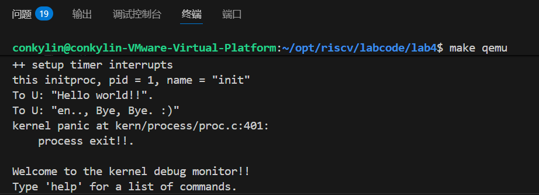
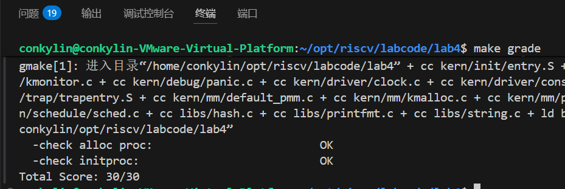

# Lab4实验报告

## 小组成员
| 姓名 | 学号 |
| :--- | :--- |

## 实验目的
本次实验的目的是通过完成三个主要练习，帮助我们理解并掌握操作系统中进程管理的基本机制，包括：
1. **分配并初始化进程控制块（PCB）**：通过为进程控制块分配内存并初始化其成员，了解进程的管理结构。
2. **内核线程资源分配与创建**：实现内核线程的创建过程，并为新线程分配必要的资源，模拟进程的`fork`操作。
3. **进程上下文切换与调度**：实现进程调度及上下文切换的代码，掌握进程如何切换并且在系统中运行。

## 实验步骤与实现

### 1. 练习1：分配并初始化进程控制块
#### 任务描述：
在`alloc_proc`函数中，分配并初始化一个新的`proc_struct`结构体，用于存储内核线程的管理信息。主要任务是完成`proc_struct`的初始化，确保新创建的进程处于正确的初始状态。

#### 实现分析：
在`alloc_proc`函数中，我按照实验要求进行了`proc_struct`的初始化。以下是我对`alloc_proc`函数的修改：

```c

proc->state = PROC_UNINIT;                 // 进程状态 - 未初始化
proc->pid = -1;                            // 进程ID - 无效值，等待分配
proc->runs = 0;                            // 运行次数 - 还未运行过
proc->kstack = 0;                          // 内核栈 - 还未分配
proc->need_resched = 0;                    // 初始不需要重新调度
proc->parent = NULL;                       // 还没有父进程
proc->mm = NULL;                           // 内存管理结构 - 还未设置
memset(&(proc->context), 0, sizeof(struct context));  // 清空上下文
proc->tf = NULL;                           // 中断帧 - 还未设置
proc->pgdir = boot_pgdir_pa;              // 初始使用启动页目录
proc->flags = 0;                           // 没有设置标志
memset(proc->name, 0, PROC_NAME_LEN + 1); // 清空进程名

```

1. **`proc->state = PROC_UNINIT;`**：进程状态初始化为`PROC_UNINIT`，表示进程尚未初始化。这是进程控制块中的关键字段，用于追踪进程的生命周期。
2. **`proc->pid = -1;`**：`pid`初始化为-1，表示进程尚未获得有效的PID。在进程创建过程中，PID会被分配。
3. **`proc->runs = 0;`**：`runs`初始化为0，表示进程尚未执行。
4. **`proc->kstack = 0;`**：`kstack`初始化为0，表示进程的内核栈尚未分配。
5. **`memset(&(proc->context), 0, sizeof(struct context));`**：`context`字段被清零，用于存储进程的上下文状态。上下文包含了进程执行时的寄存器状态，在进程切换时非常重要。

通过这些初始化，我们确保每个新进程在创建时处于一个干净的状态。
#### 问题：请说明`proc_struct`中`struct context context`和`struct trapframe *tf`成员变量的含义和在本实验中的作用。
在操作系统中，进程控制块（PCB）是管理进程的核心数据结构。`proc_struct`中有多个成员变量，其中`context`和`tf`起着至关重要的作用：

- **`context`**：该成员表示进程的上下文。上下文包含了进程在执行时需要保存的寄存器值，主要用于进程的上下文切换。通过`context`，操作系统能够保存和恢复进程的执行状态，实现进程之间的切换。
- **`trapframe *tf`**：这是一个指向`trapframe`结构体的指针，保存了进程在中断或异常发生时的状态信息。当发生中断或系统调用时，操作系统会保存当前进程的上下文信息到`trapframe`中，并在中断处理完成后恢复进程执行。

### 2. 练习2：为新创建的内核线程分配资源
#### 任务描述：
通过`do_fork`函数创建新的内核线程，分配必要的资源并复制原进程的状态。主要涉及到为新进程分配内核栈、复制上下文信息等。

#### 实现分析：
在`do_fork`函数中，我按照实验要求完成了以下步骤：

```c

1. 调用alloc_proc分配一个proc_struct
   proc = alloc_proc();
   if (proc == NULL) {
   goto fork_out;
   }

2. 调用setup_kstack为子进程分配一个内核栈
   if (setup_kstack(proc) != 0) {
   goto bad_fork_cleanup_proc;
   }

3. 调用copy_mm根据clone_flag复制或共享mm
   if (copy_mm(clone_flags, proc) != 0) {
   goto bad_fork_cleanup_kstack;
   }

4. 调用copy_thread在proc_struct中设置tf和context
   copy_thread(proc, stack, tf);

5. 将proc_struct插入hash_list和proc_list
   proc->parent = current;
   proc->pid = get_pid();
   hash_proc(proc);
   list_add(&proc_list, &(proc->list_link));
   nr_process++;

6. 调用wakeup_proc使新子进程变为RUNNABLE
   wakeup_proc(proc);

7. 使用子进程的pid设置返回值
   ret = proc->pid;

```

1. **`alloc_proc`**：为新进程分配内存，并初始化`proc_struct`结构体。
2. **`setup_kstack(proc)`**：为新进程分配内核栈，确保进程能够执行时拥有一个独立的内核栈。
3. **`copy_mm(clone_flags, proc)`**：根据`clone_flags`，决定是否复制父进程的内存管理信息。在本实验中，内核线程不需要复制内存管理结构。
4. **`copy_thread(proc, stack, tf)`**：为新进程设置`trapframe`和`context`，这两个字段分别保存进程的中断帧和上下文，用于实现上下文切换。
5. **`get_pid()`**：调用该函数为新进程分配一个唯一的PID，确保每个进程的ID在系统内是唯一的。

通过上述步骤，成功地实现了新进程的创建，并为其分配了必要的资源。进程控制块被插入到`proc_list`中，确保新进程被系统管理。

#### 问题：ucore是否做到给每个新fork的线程一个唯一的id？
是的，ucore通过`get_pid`函数为每个新创建的进程分配一个唯一的PID。通过遍历进程链表并确保PID的唯一性，`get_pid`函数能够防止PID冲突，确保系统中的每个进程都拥有唯一的标识符。

### 3. 练习3：编写`proc_run`函数
#### 任务描述：
编写`proc_run`函数，使得指定的进程能够切换到CPU上运行。实现进程的上下文切换、页表切换等功能。

#### 实现分析：
在`proc_run`函数中，我实现了以下步骤：

```c

bool intr_flag;
struct proc_struct *prev = current;

// 关闭中断以确保原子性
local_intr_save(intr_flag);

// 更新当前进程
current = proc;

// 加载新进程的页目录
lsatp(proc->pgdir);

// 执行从prev到current的上下文切换
switch_to(&(prev->context), &(proc->context));

// 重新开启中断
local_intr_restore(intr_flag);

```

1. **禁用中断**：通过`local_intr_save`宏保存当前的中断状态并禁用中断，确保在执行进程切换时不会受到中断干扰。
2. **切换进程**：将当前进程`current`更新为待运行的进程`proc`。
3. **切换页表**：调用`lsatp`函数切换到新进程的页表，确保新进程能够访问自己的内存空间。
4. **上下文切换**：通过`switch_to`函数，保存当前进程的上下文并加载新进程的上下文，实现进程的切换。
5. **恢复中断**：通过`local_intr_restore`恢复中断状态，允许其他中断继续执行。

在本实验中，`proc_run`函数成功实现了进程的上下文切换和页表切换，确保进程能够在CPU上正确执行。
#### 问题：在本实验的执行过程中，创建且运行了几个内核线程？
在实验过程中，创建并运行了两个内核线程：
1. **`idleproc`**：空闲进程，当没有其他进程可运行时，`idleproc`会执行。
2. **`initproc`**：初始化进程，是系统启动时创建的第一个进程，负责初始化系统并创建其他用户进程。

这两个线程分别负责内核的空闲处理和初始化工作。

## 扩展练习 Challenge

### 1. 说明语句 `local_intr_save(intr_flag); .... local_intr_restore(intr_flag);` 是如何实现开关中断的？

`local_intr_save` 和 `local_intr_restore` 是用于控制中断开关的宏。它们的作用是在执行关键代码时禁用和恢复中断，以确保代码的原子性，防止在执行期间发生上下文切换或其他中断干扰。

- **`local_intr_save(intr_flag)`**：该宏会保存当前的中断状态并禁用本地中断。禁用中断是为了确保在执行关键代码时，不会被其他中断打断。
  
- **`local_intr_restore(intr_flag)`**：该宏根据之前保存的中断状态来恢复中断。如果中断在调用`local_intr_save`时被禁用了，那么这时会重新启用中断。通过这种方式，确保了在执行关键操作（例如上下文切换）时的原子性。

这种机制在操作系统中非常重要，尤其是在进程调度、内存管理和设备驱动等部分，避免了在关键操作期间中断引发的问题。

### 2. 深入理解不同分页模式的工作原理（思考题）

`get_pte()` 函数负责在页表中查找或创建页表项，进而实现虚拟地址到物理地址的映射。分页机制在操作系统中非常重要，它使得每个进程拥有自己的地址空间，提高了内存的使用效率，并且隔离了进程之间的内存空间。

在RISC-V架构中，`get_pte()`函数通过不同的页表级别来处理不同的分页模式。主要有三种分页模式：SV32、SV39、SV48。

#### SV32、SV39、SV48的异同

- **SV32**：使用两级页表，每级页表项为32位，虚拟地址的前两部分分别用于索引一级和二级页表。
- **SV39**：使用三级页表，每级页表项为39位，虚拟地址的前三级部分分别用于索引一级、二级和三级页表。
- **SV48**：使用四级页表，每级页表项为48位，虚拟地址的前四部分分别用于索引一级、二级、三级和四级页表。

对于这三种分页模式，`get_pte()`函数中的代码非常相似，都是根据虚拟地址的高位部分索引页表级别，但不同的是，随着分页模式的变化，页表的级数和每级页表项的位宽也不同。这导致了在`get_pte()`中对虚拟地址的处理方式略有不同。

#### 代码相似的原因

这两段代码之所以相似，主要是因为在不同的分页模式中，分页的基本原则和页表的查找逻辑是相同的：通过虚拟地址的不同部分来索引不同级别的页表，最终找到物理页的映射。不同的分页模式只是在页表的级数和每级页表项的位宽上有所不同。

#### 是否需要拆分查找与分配功能？

目前的`get_pte()`函数将查找和分配功能合并在一起。这种写法虽然简洁，但在复杂的系统中可能带来以下问题：

1. **代码可读性差**：查找和分配操作混在一起，可能使得代码难以理解和维护。
2. **功能不清晰**：将查找和分配操作合并可能会使得代码的功能不够单一，导致后期扩展和修改时容易出错。

因此，建议将查找与分配功能拆开，分别实现`get_pte()`用于查找，`create_pte()`用于分配。这样可以提高代码的可读性和可维护性，也方便以后对不同操作的独立优化。

### 3. `get_pte()`函数中查找与分配操作的合并与拆分的优缺点

当前`get_pte()`函数将页表项的查找与分配合并在一个函数中。虽然这种实现方式简洁，但它也有一些缺点：

- **优点**：
  - 简化了代码：只需要一个函数同时处理查找和分配，代码较为简洁。
  - 功能实现较为直观：在内存较小的系统中，查找和分配通常不需要拆分。

- **缺点**：
  - **灵活性差**：当需要针对不同的分页模式或不同的操作系统特性进行优化时，拆分查找与分配会更加灵活。
  - **可维护性差**：如果以后想要修改查找或分配的具体实现，当前的方式可能需要修改整个`get_pte()`函数，增加了维护的复杂性。

因此，建议将查找与分配拆开，分别实现查找和分配功能，从而使代码更加清晰、灵活且易于维护。

## 实验截图

1. **`make qemu`指令成功结果**：


1. **`make grade`指令成功结果**：


## 本实验中的重要知识点与对应的操作系统原理
在本实验中，我学到了以下几个重要的操作系统原理，并与实验中的实现做了对应的对照：

1. **进程控制块（PCB）**：在操作系统中，进程控制块是管理进程的核心数据结构。通过`alloc_proc`实现了`proc_struct`的分配与初始化，确保进程的管理信息（如PID、状态、上下文等）能够被正确记录与跟踪。

2. **PID分配与管理**：在`get_pid`函数中，我们为每个新进程分配一个唯一的PID，这是操作系统管理进程的基础。PID分配需要确保每个进程都有独立的标识符，从而进行管理和调度。

3. **上下文切换**：`switch_to`函数用于实现进程的上下文切换，这在操作系统中是多任务处理的核心。上下文切换通过保存当前进程的状态并恢复目标进程的状态，确保进程能够正确地在CPU上执行。

4. **内核栈管理**：在创建内核线程时，为每个进程分配内核栈，确保每个进程的执行不互相干扰。内核栈的分配与释放是操作系统内存管理的重要部分。

5. **进程调度与中断管理**：在`proc_run`中，通过禁用和恢复中断来保证进程切换的正确管理，防止在关键操作期间中断的发生。

## 操作系统原理中重要但实验未涉及的知识点
在本次实验中，虽然涉及了进程的创建、上下文切换等基础内容，但仍有一些操作系统原理在实验中没有涉及，以下是其中几个重要的概念：

1. **内存管理**：虽然在实验中对内核栈进行了分配，但并未涉及更复杂的内存管理机制，如虚拟内存、页表管理、内存分配策略等。操作系统的内存管理机制通常包含了地址空间的映射、页替换、内存保护等复杂操作。

2. **文件系统管理**：实验中未涉及文件系统的实现。文件系统是操作系统的一个重要模块，负责管理文件的存储、读写操作、目录管理等。

3. **进程同步与互斥**：在实验中未涉及进程之间的同步与互斥机制，如信号量、互斥锁、条件变量等。在实际操作系统中，多个进程之间需要通过这些机制来避免竞争条件和数据不一致。

## 总结
通过本次实验，我深入理解了操作系统中进程的管理与调度机制。通过实现进程控制块的初始化、进程的创建、资源分配、上下文切换等功能，我加深了对操作系统内核中进程管理机制的理解。同时，本次实验也帮助我掌握了如何通过代码实现操作系统的关键功能，并能够在调试过程中解决遇到的实际问题。

