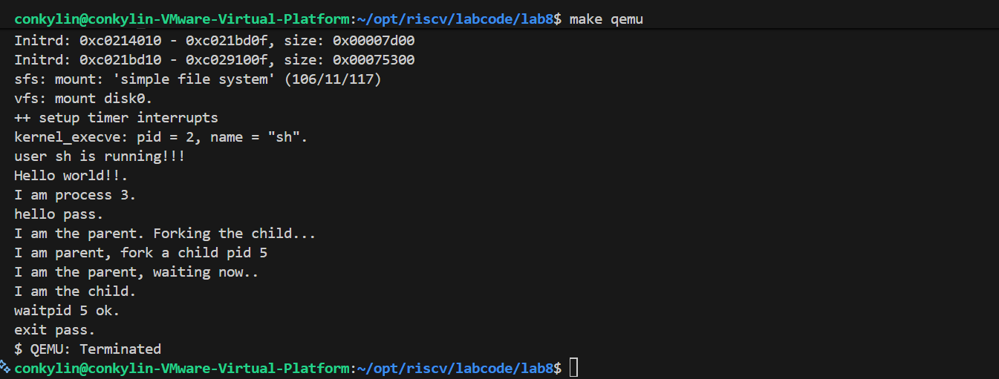
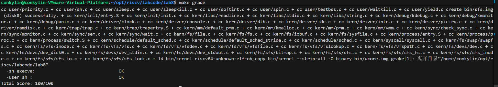

# Lab8 实验报告

## 小组成员
| 姓名 | 学号 |
| :--- | :--- |
| 郑权 | 2312482 |
| 王玉涛 | 2312364 |
| 岳科言 | 2312163 |

## 实验目的
本次 Lab8 的目标是把前序实验中逐步建立起来的进程/内存/调度等机制，与文件系统真正“接起来”，最终实现“从文件系统加载并执行用户程序”的完整闭环。核心目的包括：

1. 理解并掌握 uCore 的文件系统抽象层次：**VFS（虚拟文件系统）** → 具体文件系统（SFS）→ 设备（disk0）之间的调用路径与职责划分。
2. 完成 SFS 文件数据读写的关键实现（练习 1），掌握：
   - 文件逻辑偏移（offset）到磁盘块号（block）的映射（bmap）
   - 非对齐读写、整块读写、尾部读写三种场景的处理
   - inode 元数据（size/dirty）维护与一致性思路
3. 完成基于文件系统的 `exec` 机制（练习 2），掌握：
   - 通过文件描述符读取 ELF 文件并装载到进程地址空间
   - 根据 ELF Program Header 建立 VMA、分配页、拷贝 TEXT/DATA、清零 BSS
   - 构造用户栈参数（argc/argv）并正确设置 trapframe，进入用户态运行
4. 在前序实验基础上完成必要的“系统集成改造”，使得：
   - `make qemu` 能进入 `sh` 用户交互程序
   - `make grade` 全部通过（本次实验达到 100/100）

## 实验环境
- 目标架构：RISC-V 64
- 运行器：QEMU（通过 `make qemu` 启动）
- 文件系统：SFS（Simple File System），挂载为 `disk0`，通过 VFS 统一访问
- 构建与测试：`make qemu`、`make grade`
- 用户程序位置：`user/` 目录（最终被打包进 `bin/sfs.img` 并由内核挂载）

## 实验内容
- 练习 0：将 Lab2～Lab7 的实现整合到 Lab8，并按 Lab8 的需要进行进一步修正，保证编译与测试通过。
- 练习 1：实现 `kern/fs/sfs/sfs_inode.c` 中 `sfs_io_nolock()` 的读文件部分（本实现同时覆盖读写通路）。
- 练习 2：改写 `kern/process/proc.c` 的 `load_icode()` 等相关逻辑，实现从文件系统加载 ELF 并执行的机制。
- Challenge1：给出在 uCore 中加入 UNIX Pipe 的概要设计（数据结构 + 接口语义 + 同步互斥考虑）。
- Challenge2：给出在 uCore 中加入 UNIX 硬链接与软链接的概要设计（数据结构 + 接口语义 + 同步互斥考虑）。

---

## 练习 0：填写已有实验并适配 Lab8

本次在 `proc_struct`、`fork/exit`、`proc_run`、`proc_init` 等位置补全或增强了“文件系统相关状态”的管理与必要的硬件行为。

#### 改动点 A：为进程增加并初始化 `filesp`（文件相关信息）
在 `kern/process/proc.c: alloc_proc()` 中新增初始化：

```c
// LAB8 add:
proc->filesp = NULL;
```

对应意义：
- `filesp` 指向 `struct files_struct`，内部维护：
  - 当前工作目录 `pwd`
  - 文件描述符数组 `fd_array`
  - 引用计数 `files_count`
  - 同步用信号量 `files_sem`
- 这使得“每个进程”都可以拥有独立或共享的文件视图（cwd+fd table），并为后续 `fork/exec/exit` 的语义落地提供支撑。

#### 改动点 B：`proc_init()` 初始化 `idleproc` 的 `filesp`
`idleproc` 是内核启动后的第一个内核线程，必须拥有基础的 `filesp`，否则之后的文件操作（例如 `sysfile_open`）会在缺乏 `current->filesp` 的情况下崩溃或行为未定义：

```c
if ((idleproc->filesp = files_create()) == NULL) {
    panic("create filesp (idleproc) failed.\n");
}
files_count_inc(idleproc->filesp);
```

#### 改动点 C：`proc_run()` 在切换页表后刷新 TLB
本次在 `proc_run()` 中，在 `lsatp(proc->pgdir)` 之后加入 `flush_tlb()`：

```c
// 加载新进程的页目录
lsatp(proc->pgdir);

// LAB8: 刷新TLB
flush_tlb();

// 上下文切换
switch_to(&(prev->context), &(proc->context));
```

原因说明：
- Lab8 引入更频繁的地址空间变化（尤其是 `exec` 时新建 mm + 切换 pgdir）。
- RISC-V 的 TLB 可能缓存旧的虚拟地址翻译。如果切换 SATP 后不刷新，可能出现：
  - 访问到旧进程的页表翻译（越权/错误数据）
  - 执行新程序时取指/访存异常
- 因此切换页表后刷新 TLB 是一种稳健做法（真实 OS 通常通过 `sfence.vma` 完成）。

#### 改动点 D：`do_fork()` 复制文件表（files_struct）
Lab8 的 `fork` 语义不仅要复制/共享内存，还要对文件相关状态做一致处理。实现采用引用计数与深拷贝结合的方式：

1) 若 `clone_flags & CLONE_FS`：共享父进程的 `filesp`（类似 Linux 共享文件系统上下文的语义）  
2) 否则：创建新的 `files_struct` 并 `dup_files()` 复制父进程已打开文件状态（文件描述符表）

关键代码路径：

```c
// LAB8: 复制文件描述符
if (copy_files(clone_flags, proc) != 0) {
    goto bad_fork_cleanup_kstack;
}
```

并在错误路径与退出路径做 `put_files(proc)`，确保引用计数正确回收。

#### 改动点 E：`do_exit()` 回收 files_struct
进程退出时不仅需要释放 mm，也需要释放与文件相关的资源：

```c
current->mm = NULL;
put_files(current);
```

该回收与 `files_count_dec()` 引用计数配合，确保：
- 多进程共享 `filesp` 时不会被提前销毁
- 最后一个引用退出后再释放 `files_struct` 与其中的 `fd_array` 等资源

---

## 练习 1：完成读文件操作 `sfs_io_nolock()` 的实现

### 1.1 任务描述
在 `kern/fs/sfs/sfs_inode.c` 中补全 `sfs_io_nolock()`，实现从指定 `offset` 开始、长度为 `*alenp` 的文件读操作（本实现同样支持写操作，因为函数本身以 `write` 参数区分读/写）。

### 1.2 打开/读文件的整体调用链
本练习编码点在 SFS 层，但要理解其位置，需要知道上层调用链大致如下：

1) 用户态：`read(fd, buf, len)`  
2) 系统调用：`sysfile_read(fd, ...)`（负责用户态/内核态缓冲区拷贝、循环读）  
3) VFS/File 层：`file_read(fd, ...)`（通过 file->node 调到 vnode/inode 的操作）  
4) VOP 层：`vop_read(inode, iobuf)`  
5) SFS 层：`sfs_read()` → `sfs_io()`（加锁封装） → `sfs_io_nolock()`（核心逻辑）

因此 `sfs_io_nolock()` 的正确性直接决定了整个文件读写体系是否可靠。

### 1.3 `sfs_io_nolock()` 关键设计点
`offset` 与 `endpos = offset + len` 可能不按块对齐，因此必须拆分为三段处理：

1) **首块非对齐段**：如果 `offset % BLKSIZE != 0`  
   - 读取/写入首个块的部分内容（从 `blkoff` 到块末尾）
2) **中间整块段**：对齐块的连续读/写  
   - 直接使用块读写函数进行整块操作，提高效率
3) **尾块非对齐段**：如果 `endpos % BLKSIZE != 0`  
   - 读取/写入最后一个块的前 `size` 字节

同时需要调用 `sfs_bmap_load_nolock()` 把“文件逻辑块号”映射到“磁盘块号”（或分配新块）。

### 1.4 代码实现（练习 1）
实现位于 `sfs_inode.c::sfs_io_nolock()`，核心片段如下（与源代码一致）：

```c
blkoff = offset % SFS_BLKSIZE;
if (blkoff != 0) {
    size = (nblks != 0) ? (SFS_BLKSIZE - blkoff) : (endpos - offset);
    if ((ret = sfs_bmap_load_nolock(sfs, sin, blkno, &ino)) != 0) {
        goto out;
    }
    if ((ret = sfs_buf_op(sfs, buf, size, ino, blkoff)) != 0) {
        goto out;
    }
    alen += size;
    if (nblks == 0) {
        goto out;
    }
    buf += size;
    blkno++;
    nblks--;
}

// (2) 读写对齐的块
while (nblks > 0) {
    if ((ret = sfs_bmap_load_nolock(sfs, sin, blkno, &ino)) != 0) {
        goto out;
    }
    if ((ret = sfs_block_op(sfs, buf, ino, 1)) != 0) {
        goto out;
    }
    alen += SFS_BLKSIZE;
    buf += SFS_BLKSIZE;
    blkno++;
    nblks--;
}

// (3) 尾部非对齐
size = endpos % SFS_BLKSIZE;
if (size != 0) {
    if ((ret = sfs_bmap_load_nolock(sfs, sin, blkno, &ino)) != 0) {
        goto out;
    }
    if ((ret = sfs_buf_op(sfs, buf, size, ino, 0)) != 0) {
        goto out;
    }
    alen += size;
}
```

### 1.5 实现细节与边界条件说明
1. 读操作需要被文件大小截断：  
   - 若 `offset >= din->size` 直接返回 0  
   - 若 `endpos > din->size` 则 `endpos = din->size`  
   这样可以保证不会读到“文件末尾之外”的无效空间。

2. `SFS_MAX_FILE_SIZE` 上限保护：  
   - 防止越界读写导致元数据或块映射损坏。

3. inode size/dirty 维护：  
   在 `out:` 处根据 `offset + alen` 是否超过当前 size 更新 `din->size` 并设置 `sin->dirty = 1`，保证写入后元数据能被刷新到磁盘。

4. 加锁策略：  
   - `sfs_io()` 在调用 `sfs_io_nolock()` 前对 inode 加锁  
   - `sfs_io_nolock()` 假设外部已经持锁，因此内部不再加锁以避免重复锁开销与潜在死锁

---

## 练习 2：完成基于文件系统的执行程序机制（`exec`）

### 2.1 任务描述
改写 `kern/process/proc.c` 中的 `load_icode()` 与相关逻辑，实现：
- 通过文件系统读取 ELF 可执行文件
- 按 ELF Program Header 将程序段装载到新地址空间
- 正确建立用户栈与参数
- 通过 trapframe 设置，最终进入用户态运行（如 `sh`、`hello`、`exit` 等均在 SFS 中）

### 2.2 `exec` 的整体路径
以启动 `sh` 为例，路径可概括为：

1) `user_main()`（内核线程）调用 `KERNEL_EXECVE2(sh)`  
2) `kernel_execve()` 构造新的 trapframe 并调用 `do_execve()`  
3) `do_execve()`  
   - 拷贝用户态参数到内核（`copy_kargv`）  
   - 关闭旧进程打开的文件（`files_closeall`）  
   - `sysfile_open(path, O_RDONLY)` 打开 ELF 文件，得到 `fd`  
   - 若原 mm 存在则释放旧地址空间  
   - 调用 `load_icode(fd, argc, kargv)` 创建新 mm 并装载 ELF  
4) 成功后返回到 `__trapret`，通过 trapframe 进入用户态执行 ELF 的入口点 `e_entry`

### 2.3 `load_icode_read()`：基于 fd 的随机读取封装
为了在 ELF 装载时多次读取不同 offset 的内容，实现了：

```c
static int load_icode_read(int fd, void *buf, size_t len, off_t offset) {
    int ret;
    if ((ret = sysfile_seek(fd, offset, LSEEK_SET)) != 0) {
        return ret;
    }
    if ((ret = sysfile_read(fd, buf, len)) != len) {
        return (ret < 0) ? ret : -1;
    }
    return 0;
}
```

设计意义：
- ELF 头、Program Header、各段内容都位于不同 offset
- 把 “seek + read + 长度检查” 封装为一个工具函数，使 `load_icode()` 更清晰

### 2.4 `load_icode()` 的实现思路与步骤分解
`load_icode()` 的关键步骤与 Lab5 “从内存加载用户程序”类似，但数据来源变为“文件系统中的 ELF 文件”。

#### Step (1) 创建新的 mm
```c
if ((mm = mm_create()) == NULL) goto bad_mm;
```

#### Step (2) 创建页目录并挂接到 mm
```c
if (setup_pgdir(mm) != 0) goto bad_pgdir_cleanup_mm;
```

#### Step (3) 解析 ELF，并按 Program Header 装载各段
核心流程：
1) 读取 ELF Header，检查 `ELF_MAGIC`
2) 遍历 `e_phnum` 个 Program Header
3) 对 `PT_LOAD` 段：
   - 计算 VMA 权限与 PTE 权限（U/R/W/X）
   - `mm_map()` 建立 VMA
   - 按页分配并拷贝 `filesz` 内容（TEXT/DATA）
   - 对剩余 `memsz - filesz` 部分清零（BSS）

关键代码片段：

```c
// 读取ELF头并校验
if ((ret = load_icode_read(fd, elf, sizeof(struct elfhdr), 0)) != 0) goto bad_elf_cleanup_pgdir;
if (elf->e_magic != ELF_MAGIC) { ret = -E_INVAL_ELF; goto bad_elf_cleanup_pgdir; }

// 遍历 Program Header
for (phnum = 0; phnum < elf->e_phnum; phnum++) {
    off_t phoff = elf->e_phoff + sizeof(struct proghdr) * phnum;
    if ((ret = load_icode_read(fd, ph, sizeof(struct proghdr), phoff)) != 0) goto bad_cleanup_mmap;
    if (ph->p_type != ELF_PT_LOAD) continue;

    // 建立 vma
    vm_flags = 0, perm = PTE_U | PTE_V;
    ...
    if ((ret = mm_map(mm, ph->p_va, ph->p_memsz, vm_flags, NULL)) != 0) goto bad_cleanup_mmap;

    // 分页读入 filesz
    end = ph->p_va + ph->p_filesz;
    while (start < end) {
        if ((page = pgdir_alloc_page(mm->pgdir, la, perm)) == NULL) goto bad_cleanup_mmap;
        ...
        if ((ret = load_icode_read(fd, page2kva(page) + off, size, offset)) != 0) goto bad_cleanup_mmap;
        start += size, offset += size;
    }

    // 清零 BSS
    end = ph->p_va + ph->p_memsz;
    while (start < end) {
        if ((page = pgdir_alloc_page(mm->pgdir, la, perm)) == NULL) goto bad_cleanup_mmap;
        ...
        memset(page2kva(page) + off, 0, size);
        start += size;
    }
}
```

说明要点：
- `ROUNDDOWN(start, PGSIZE)` 让 `la` 对齐到页边界
- `pgdir_alloc_page(pgdir, la, perm)` 在页表中建立映射并分配物理页
- `page2kva(page)` 得到内核虚拟地址以便拷贝数据
- `filesz` 表示文件中真实存在的数据长度，`memsz` 表示运行时需要的内存大小，差值对应 BSS

#### Step (4) 建立用户栈 VMA 并预分配若干页
```c
vm_flags = VM_READ | VM_WRITE | VM_STACK;
mm_map(mm, USTACKTOP - USTACKSIZE, USTACKSIZE, vm_flags, NULL);

pgdir_alloc_page(mm->pgdir, USTACKTOP - PGSIZE, PTE_USER);
pgdir_alloc_page(mm->pgdir, USTACKTOP - 2 * PGSIZE, PTE_USER);
pgdir_alloc_page(mm->pgdir, USTACKTOP - 3 * PGSIZE, PTE_USER);
pgdir_alloc_page(mm->pgdir, USTACKTOP - 4 * PGSIZE, PTE_USER);
```

为什么要预分配多页：
- 便于放置 argv 字符串与 argv 指针数组
- 避免首次用户态访问栈顶就触发缺页异常

#### Step (5) 切换到新地址空间
```c
mm_count_inc(mm);
current->mm = mm;
current->pgdir = PADDR(mm->pgdir);
lsatp(PADDR(mm->pgdir));
```

#### Step (6) 构造用户栈上的 argc/argv
本实现把参数从内核 `kargv` 拷贝到用户栈空间，并设置 `a0/a1`：

```c
uintptr_t stacktop = USTACKTOP - (argc + 1) * sizeof(char *);
char **uargv = (char **)(stacktop - argc * sizeof(char *));
stacktop = (uintptr_t)uargv;

for (i = 0; i < argc; i++) {
    uargv[i] = strcpy((char *)(stacktop -= strlen(kargv[i]) + 1), kargv[i]);
}
stacktop = ROUNDDOWN(stacktop, sizeof(long));
stacktop -= sizeof(int);
*(int *)stacktop = argc;
```

语义说明：
- 用户栈从高地址向低地址增长，因此字符串与结构都向低地址压入
- `uargv[i]` 指向用户栈中对应的字符串位置
- 最终把 `argc` 与 `uargv` 分别放入 `a0/a1`

#### Step (7) 设置 trapframe 并进入用户态
```c
struct trapframe *tf = current->tf;
uintptr_t sstatus = tf->status;
memset(tf, 0, sizeof(struct trapframe));
tf->gpr.sp = stacktop;
tf->epc = elf->e_entry;
tf->status = (sstatus & ~SSTATUS_SPP) | SSTATUS_SPIE;
tf->gpr.a0 = argc;
tf->gpr.a1 = (uintptr_t)uargv;
```

关键点解释：
- `epc = e_entry`：用户态从 ELF 入口点开始执行
- 清除 `SSTATUS_SPP`：确保返回时进入 U-mode
- `SSTATUS_SPIE`：开启用户态中断使能（返回后可响应中断）

#### Step (8) 错误处理与资源回收
在任意阶段失败，需要释放已创建资源：
- `exit_mmap(mm)`：释放 VMA 与已映射页面
- `put_pgdir(mm)`：释放页目录
- `mm_destroy(mm)`：释放 mm 结构本身

本实现采用 `goto` 错误路径集中回收。

---

## 实验验证与结果截图

1. `make qemu`：能够从文件系统执行 `sh`，并运行用户程序输出，最后 `exit` 正常执行。



2. `make grade`：测试用例全部通过，总分 100/100。



---

## 扩展练习 Challenge1：UNIX PIPE 机制的设计方案

### 设计目标与语义要求
Pipe 是一种典型 IPC（进程间通信）机制，语义要点包括：
1. `pipe(int fd[2])` 创建一条单向字节流通道，返回读端 `fd[0]`、写端 `fd[1]`
2. 读端：
   - 若缓冲区为空且写端仍存在：阻塞等待（或非阻塞返回 EAGAIN）
   - 若写端全部关闭且缓冲区为空：读返回 0（EOF）
3. 写端：
   - 若缓冲区满且读端仍存在：阻塞等待（或非阻塞返回 EAGAIN）
   - 若读端全部关闭：写返回错误（典型 UNIX 语义为 SIGPIPE/EPIPE）
4. 与 `fork/dup/close` 的交互：
   - `fork` 后 pipe 的两端文件描述符会被复制，引用计数增加
   - 当最后一个读端/写端关闭时释放 pipe 对象

### 需要新增/扩展的数据结构
把 pipe 做成一种“特殊文件”（special file），与现有 `file`/`inode`/`vop` 框架对齐。

1) pipe 核心对象：环形缓冲区 + 同步结构 + 引用计数

```c
#define PIPE_BUF 4096

typedef struct pipe {
    // 环形缓冲区
    uint8_t  buf[PIPE_BUF];
    uint32_t rpos;          // read position
    uint32_t wpos;          // write position
    uint32_t data;          // 当前有效数据量

    // 引用计数：分别统计读端/写端还有多少打开实例
    int readers;
    int writers;

    // 同步互斥
    semaphore_t mutex;      // 保护 rpos/wpos/data/readers/writers
    wait_queue_t rq;        // 读等待队列（buffer empty）
    wait_queue_t wq;        // 写等待队列（buffer full）
} pipe_t;
```

2) file 层对接：为 pipe 定义一套 file_ops/vop 接口
- 可以增加 `FD_PIPE` 或复用 `struct inode` 的一个新 type（如 `SFS_TYPE_PIPE` 也可行，但更常见是“无磁盘 inode 的匿名对象”）

```c
struct pipe_file {
    pipe_t *p;
    bool is_read_end;
};
```

### 需要提供的接口
系统调用层（用户可见）：
- `int sys_pipe(int fd[2]);`
  - 分配 pipe_t
  - 分配两个 file 对象，分别标记为读端/写端
  - 安装到当前进程 fd 表，返回两个 fd

file/vop 层（内核内部）：
- `ssize_t pipe_read(struct file *f, void *buf, size_t len, size_t *copied);`
- `ssize_t pipe_write(struct file *f, const void *buf, size_t len, size_t *copied);`
- `int pipe_close(struct file *f);`
- `int pipe_dup(struct file *to, struct file *from);`

### 同步互斥与竞态处理要点
1. 多读多写并发：  
   - 必须用 `mutex` 保护 `data/rpos/wpos` 等共享状态  
   - 防止两个 writer 同时写导致覆盖，两个 reader 同时读导致重复读取

2. 阻塞/唤醒条件：  
   - 读：`while (data == 0 && writers > 0) sleep(rq)`  
   - 写：`while (data == PIPE_BUF && readers > 0) sleep(wq)`  
   - 状态变化后 `wakeup(rq)` 或 `wakeup(wq)`  
   - 注意避免“丢失唤醒”：检查条件与入队睡眠必须在同一临界区（mutex 内）完成

3. 关闭语义：  
   - 关闭读端：`readers--`，若变为 0，唤醒所有 writer（使其返回 EPIPE）  
   - 关闭写端：`writers--`，若变为 0，唤醒所有 reader（使其读到 EOF 或继续消费缓冲区）

---

## 扩展练习 Challenge2：UNIX 软链接与硬链接机制的设计方案

### 2.1 硬链接（Hard Link）
硬链接的本质：**目录项（dirent）指向同一个 inode**，inode 内维护 `nlinks`（链接计数）。

#### 需要/复用的数据结构
uCore/SFS 本身已经有 `sfs_disk_inode.nlinks` 字段，可直接用于硬链接计数；目录项需要能存储 inode 号（SFS 通常目录项包含 inode number + name）。

#### 需要提供的接口
- `int sys_link(const char *oldpath, const char *newpath);`
  1) 解析 `oldpath` 得到 inode（必须存在、通常不允许为目录）
  2) 在 `newpath` 所在目录中创建新目录项，指向 old inode
  3) `inode->nlinks++`，并持久化 inode 与目录块

- `int sys_unlink(const char *path);`
  1) 在目录中删除该目录项
  2) `inode->nlinks--`
  3) 若 `nlinks==0` 且没有打开引用，则回收数据块与 inode

#### 同步互斥要点
- 目录修改必须加锁（避免并发创建同名项/删除同一项）
- inode 的 `nlinks` 更新必须与目录项变更原子化（至少在同一锁保护区内）
- 若有多级锁（目录锁 + inode 锁），需规定锁顺序避免死锁（例如：先锁目录，再锁 inode）

### 2.2 软链接（Symbolic Link）
软链接的本质：**一个独立的 inode，内容是目标路径字符串**。路径解析（namei）遇到 symlink 时需要“跳转”到目标路径继续解析。

#### 建议新增的数据结构/扩展点
1) 新 inode 类型：例如在 SFS 中增加
- `SFS_TYPE_SYMLINK`

2) symlink inode 的数据内容
- 最简单做法：把“目标路径字符串”当作普通文件内容存储（写入数据块），并用 `din->size` 记录长度
- 小路径可做 inode 内联优化

#### 需要提供的接口
- `int sys_symlink(const char *target, const char *linkpath);`
  1) 在 `linkpath` 创建一个新 inode，type=SYMLINK
  2) 写入 `target` 字符串到 symlink inode 数据区
  3) 在目录中创建目录项指向该 inode

- `int sys_readlink(const char *path, char *buf, size_t buflen);`
  1) 解析到 symlink inode
  2) 读取其内容（target path）到用户缓冲区（不追加 '\0' 或按 UNIX 语义处理）

- 路径解析增强：`namei()` / `vfs_lookup()` 遇到 symlink 时
  - 读取其目标路径
  - 若目标是相对路径：以 symlink 所在目录为基准拼接
  - 设置最大跳转深度（例如 8 或 40）防止循环链接：`ELOOP`

#### 同步互斥要点
- symlink 创建与读写需 inode 锁保护
- 路径解析时需要注意：解析过程可能跨目录/跨 inode，多锁情况下要严格锁顺序或使用引用计数与“逐段加锁、逐段释放”的策略降低死锁风险

---

## 本实验中的重要知识点与对应的 OS 原理

1. VFS 抽象与具体文件系统实现（SFS）
   - 原理侧：VFS 提供统一接口（open/read/write/lookup），屏蔽具体 FS 差异，是“面向对象式”的内核抽象。
   - 实验侧：通过 `vop_read` → `sfs_read` → `sfs_io_nolock` 体现出“接口与实现解耦”。
   - 关系：VFS 是上层“语义统一”，SFS 是下层“策略与布局具体化”；二者通过 vnode/inode 与 vop 表连接。

2. inode / 目录项 / 数据块：文件系统的核心元数据组织
   - 原理侧：inode 存储文件属性与数据块指针；目录项将文件名映射到 inode。
   - 实验侧：`sfs_disk_inode` 提供 `size/blocks/nlinks`，`sfs_bmap_load_nolock` 提供逻辑块到物理块映射，`sfs_io_nolock` 完成真正的数据读写。
   - 差异点：实验文件系统较简化（SFS），没有日志、没有复杂缓存策略，但核心元数据思想一致。

3. 文件读写的“对齐/非对齐”处理与块设备 I/O
   - 原理侧：文件系统通常以块为单位管理磁盘，非对齐读写需要读-改-写或部分读。
   - 实验侧：`sfs_io_nolock` 明确拆分三段（首块非对齐 / 中间整块 / 尾块非对齐），体现真实 FS 的典型处理方式。

4. 进程的文件描述符表与 fork/exit 资源管理
   - 原理侧：进程是资源容器，fd table 是“进程对文件对象的引用集合”；fork 需要复制引用，exit 需要释放引用。
   - 实验侧：`proc_struct.filesp` + `copy_files()` + `put_files()` + 引用计数 `files_count` 完成资源共享与回收。
   - 关系：这属于“面向资源的进程模型”，与 Linux/Unix 语义一致。

5. exec 装载器与 ELF 格式
   - 原理侧：exec 会用新程序替换当前进程地址空间；ELF 描述段布局与权限。
   - 实验侧：`load_icode_read` 从文件系统读取 ELF；`mm_map/pgdir_alloc_page` 建立映射；按 `filesz/memsz` 处理 DATA/BSS；设置 `epc/sp/a0/a1` 进入用户态。
   - 差异点：实验使用 eager 分配栈页、没有按需分页与 page cache，但整体装载逻辑与真实 OS 同构。

6. 地址空间切换与 TLB 一致性
   - 原理侧：切换页表后需要维护 TLB 与页表一致，否则会执行/访问错误映射。
   - 实验侧：`proc_run` 加入 `flush_tlb()`，与 RISC-V 的 `sfence.vma` 对应。

7. 用户态/内核态切换与 trapframe
   - 原理侧：系统调用/异常依赖保存现场与恢复现场；trapframe 是核心。
   - 实验侧：exec 完成后通过设置 trapframe 的 `epc/sp/status/a0/a1`，使 `__trapret` 能正确返回用户态运行新程序。

---

## OS 原理中很重要但在本实验中没有对应实现的知识点

1. 崩溃一致性与日志文件系统（Journaling / WAL）
   - 真实 OS 必须保证断电崩溃后文件系统一致性；SFS 实验未实现日志与事务。

2. Page Cache / Buffer Cache 的统一与写回策略
   - 真实系统通过页缓存减少磁盘 IO，并有复杂的写回/回收策略；实验中的缓存与一致性策略较简化。

3. 按需分页（Demand Paging）与缺页异常驱动的装载
   - 实验中 exec 时主动把段内容拷贝进内存并预分配栈；真实系统可采用按需调页、延迟分配与 COW 等优化。

4. 更丰富的权限与安全机制
   - UNIX 权限位、ACL、Capability、SELinux 等，在实验中未实现或未展开。

5. 更完整的 IPC 体系
   - 信号（signal）、共享内存、消息队列、socket 等；本实验仅在挑战题中讨论 pipe 的设计。

6. 多核并发下的可扩展性问题
   - 真实 OS 在 SMP 下需要更严格的锁设计、RCU、无锁数据结构等；实验平台多为单核/简化并发场景。

---

## 总结
Lab8 通过“补全文件系统读写关键路径”与“实现基于文件系统的 exec 装载”把 uCore 的多个子系统串联成一个可运行的最小操作系统：既能挂载文件系统，也能从磁盘读出 ELF 并运行用户程序。  
在实现过程中，最关键的经验是：单个功能点完成并不意味着系统可用，必须从调用链、资源生命周期、地址空间切换与同步互斥等角度做整体一致性检查。最终 `make qemu` 进入 `sh` 且 `make grade` 达到 100/100，说明核心机制实现正确并完成了系统集成目标。
